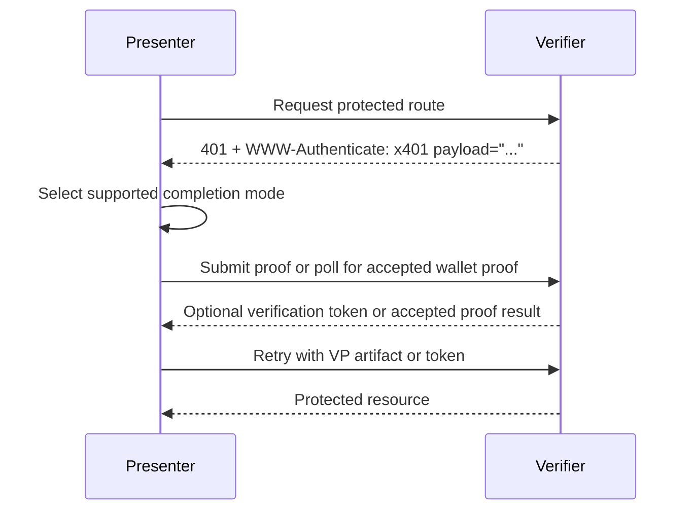
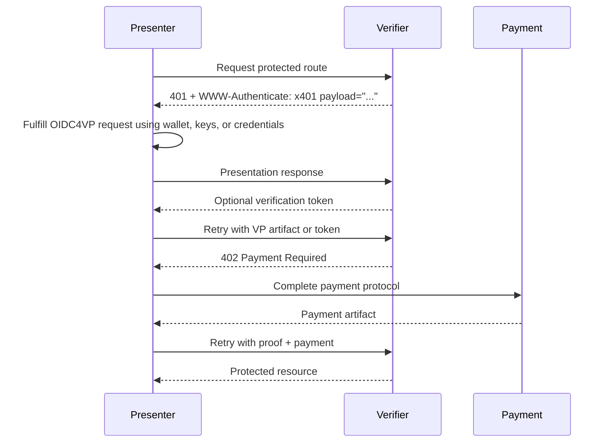

x401: HTTP Proof Challenge Protocol
==================

Status: Draft

Version: 0.1.0

Editors:
~ Daniel Buchner

Participate:
~ [GitHub repo](https://github.com/csuwildcat/x401)
~ [File an issue](https://github.com/csuwildcat/x401/issues)
~ [Commit history](https://github.com/csuwildcat/x401/commits/main)

------------------------------------

## Abstract

x401 defines an HTTP-based, route-scoped proof challenge protocol for requiring credential-based proof before access to a protected resource is granted.

x401 uses:

- **HTTP 401 Unauthorized** to signal that proof is required
- **OpenID for Verifiable Presentations (OIDC4VP)** as the proof request and presentation mechanism
- **OpenID for Verifiable Credential Issuance (OIDC4VCI)** for optional, non-authoritative issuance hints that help presenters discover where qualifying credentials may be obtained
- **OAuth 2.0 Token Exchange** and **OAuth 2.0 Device Authorization** as optional, standards-based ways to convert accepted proof into a reusable verification token

x401 is intentionally separate from payment protocols. When payment is required, it MUST be handled with **HTTP 402 Payment Required** and an appropriate payment protocol. x401 MUST NOT redefine payment semantics.

This document defines the x401 payload, processing rules, interoperability requirements, and examples for proof-only and proof-plus-payment flows.

::: note Protocol Boundary
x401 defines proof challenge semantics only. When payment is required, implementations still use `402 Payment Required` and a separate payment protocol.
:::

## Status of This Document

This is a draft specification. It is provided in a style intended to be similar to DIF single-file specifications.

## Introduction

HTTP provides a standard challenge mechanism for authentication via `401 Unauthorized` and `WWW-Authenticate`, but it does not define a general-purpose, machine-readable protocol for route-scoped proof requirements such as:

- proving personhood
- proving country of residency
- proving membership or accreditation
- proving entitlement issued by a specific issuer class
- proving organizational standing
- proving a delegated or workload identity attribute

At the same time, the OpenID4VP and OIDC4VCI specifications define interoperable mechanisms for requesting presentations and issuing credentials, but they are not themselves an HTTP route challenge protocol.

x401 fills that gap by defining an HTTP-native wrapper that:

- signals proof requirements at the protected route
- carries the x401 payload as a base64url value in the `WWW-Authenticate` response header
- carries or references an OIDC4VP proof request
- optionally includes OIDC4VCI-based issuance hints
- supports agent-brokered and wallet-mediated completion flows
- composes with, but does not subsume, payment protocols

In the typical flow, a [[ref: Presenter]] receives a challenge from a [[ref: Verifier]] and uses access to a [[ref: Wallet]], keys, credentials, or wallet-mediated authorization flow to satisfy the embedded or referenced [[ref: Proof Request]]. Any [[ref: Issuance Hint]] data is advisory only.

## Design Goals

The goals of x401 are:

1. Define a route-scoped proof challenge for HTTP resources.
2. Reuse existing proof and issuance standards where possible.
3. Support both human-facing and agentic flows.
4. Remain separate from payment semantics.
5. Allow issuance discovery hints without making them authoritative verification rules.
6. Allow proof requirements to be returned by reference.
7. Support both agent-brokered proof submission and no-callback wallet-mediated proof completion.
8. Support stateless verifier deployments by allowing challenge and continuation context to be encoded in verifier-protected artifacts.

## Non-Goals

x401 does not:

- define a new credential format
- replace OIDC4VP
- replace OIDC4VCI
- define a wallet invocation protocol
- define a payment protocol
- require all verifiers to maintain server-side session state

## Terminology

The key words **MUST**, **MUST NOT**, **REQUIRED**, **SHALL**, **SHALL NOT**, **SHOULD**, **SHOULD NOT**, **RECOMMENDED**, **NOT RECOMMENDED**, **MAY**, and **OPTIONAL** in this document are to be interpreted as described in RFC 2119 and RFC 8174.

[[def: Verifier]]:
~ The party protecting a resource or operation and requiring proof.

[[def: Holder]]:
~ The subject or presenter that possesses credentials and can present proof.

[[def: Wallet]]:
~ Software capable of fulfilling an OIDC4VP presentation request.

[[def: Presenter]]:
~ The party or software component that requests the protected route, submits proof material to the [[ref: Verifier]], receives verifier responses, and later retries the protected route. A Presenter can be the [[ref: Holder]] or a [[ref: Delegated Presenter]].

[[def: Delegated Presenter]]:
~ A [[ref: Presenter]] that is authorized to present credential-derived evidence on behalf of another party, such as an agent, workload, or service acting for a user.

[[def: Delegation Authorization]]:
~ A durable, signed, revocable authorization object created by the holder, user, wallet, or authorization tool that assigns a [[ref: Delegated Presenter]] the ability to present credential-derived evidence on behalf of another party. It is bound to a delegated presenter identifier or key and lists the credential types and constraints the delegated presenter is allowed to use.

[[def: Delegation Evidence]]:
~ The [[ref: Delegation Authorization]] submitted with an OIDC4VP response, plus the presentation proof or other verifier-accepted binding showing that the current presenter controls the delegated presenter identifier or key named in that authorization.

[[def: Proof Request]]:
~ An OpenID4VP Authorization Request, conveyed by reference, that describes the credentials, claims, predicates, or constraints that must be satisfied.

[[def: Issuance Hint]]:
~ A non-authoritative HTTPS origin or DID describing where the presenter may be able to discover OIDC4VCI issuer metadata for credentials that could satisfy the proof request.

[[def: VP Artifact]]:
~ A retry artifact containing the full OIDC4VP response needed to verify proof fulfillment, including the OIDC4VP `vp_token` and any required accompanying parameters such as `state` and `presentation_submission`, encoded for use in the HTTP `Authorization` request header.

[[def: Verification Token]]:
~ A verifier-issued, short-lived retry token returned after successful proof verification and used by the [[ref: Presenter]] on later protected-route requests so that the OIDC4VP presentation does not need to be repeated.

[[def: Completion Mode]]:
~ A verifier-advertised method by which a [[ref: Presenter]] can complete a x401 challenge and obtain a retry artifact.

[[def: Agent-Brokered Completion]]:
~ A [[ref: Completion Mode]] in which the [[ref: Presenter]] creates or obtains the OIDC4VP response from a local wallet, wallet API, credential subsystem, or delegated authority, and the [[ref: Presenter]] submits the proof or token request itself.

[[def: Wallet-Mediated Device Completion]]:
~ A [[ref: Completion Mode]] in which a wallet, browser, cloud wallet, or holder device completes the OIDC4VP presentation directly with the [[ref: Verifier]], while the [[ref: Presenter]] uses the OAuth 2.0 Device Authorization Grant to poll for the resulting [[ref: Verification Token]] without exposing an inbound callback URI.

[[def: x401 Payload]]:
~ The JSON object defined by this specification, UTF-8 encoded, and carried as a base64url value in the `payload` parameter of the `WWW-Authenticate: x401` response header.

## Protocol Overview

### Proof-Only Flow

In the base x401 flow, the [[ref: Presenter]] is the HTTP caller. The [[ref: Presenter]] either uses [[ref: Agent-Brokered Completion]] to create or obtain the OIDC4VP response and submit it itself, or uses [[ref: Wallet-Mediated Device Completion]] when an external wallet completes the presentation directly with the [[ref: Verifier]].

1. The [[ref: Presenter]] requests a protected route.
2. The [[ref: Verifier]] determines that proof is required.
3. The [[ref: Verifier]] returns `401 Unauthorized` with:
   - `WWW-Authenticate: x401 payload="<base64url-x401-payload>"`
4. The [[ref: Presenter]] processes the embedded or referenced OIDC4VP [[ref: Proof Request]] and chooses a verifier-supported [[ref: Completion Mode]].
5. In [[ref: Agent-Brokered Completion]], the [[ref: Presenter]] creates or obtains the OIDC4VP response and submits the proof or token request itself.
6. In [[ref: Wallet-Mediated Device Completion]], the [[ref: Presenter]] starts an OAuth 2.0 Device Authorization transaction, hands the wallet-facing verification URI or code to the wallet or user, and polls the token endpoint until the wallet-mediated OIDC4VP presentation is accepted.
7. The [[ref: Presenter]] retries the protected route with either a [[ref: VP Artifact]] or a verifier-issued [[ref: Verification Token]] in the HTTP `Authorization` request header.
8. The [[ref: Verifier]] validates the proof or token and returns the protected resource if successful.



## OIDC Boundary and Reuse

x401 stays intentionally narrow. It defines the HTTP challenge at the protected route and the payload that carries proof and acquisition data. It does not redefine the OIDC objects carried inside that payload.

The protocol boundary is:

1. x401 governs the protected-route exchange up to `401 Unauthorized` and the `WWW-Authenticate: x401` challenge containing the x401 payload.
2. OIDC4VP takes over as soon as the [[ref: Presenter]] dereferences `proof.request_uri`.
   - The `proof.request_uri` member is the OIDC4VP `request_uri` transport, and the dereferenced resource MUST satisfy OpenID4VP Section 5.7, Section 5.10.1, and RFC 9101: <https://openid.net/specs/openid-4-verifiable-presentations-1_0-final.html>, <https://datatracker.ietf.org/doc/html/rfc9101>.
3. Presenter-to-verifier proof submission then follows standard OIDC4VP response handling.
   - `vp_token` response semantics: OpenID4VP Section 8.1.
   - `direct_post` and `response_uri`: OpenID4VP Section 8.2.
   - Verifier validation of `client_id` and `nonce` binding: OpenID4VP Section 8.6 and Section 14.1.2.
4. Delegation evidence, when required, is declared by x401 metadata around the OIDC4VP request and submitted with the OIDC4VP response in the same completion transaction. x401 does not change the OIDC4VP `vp_token` structure.
5. x401 resumes when the verifier has accepted the OIDC4VP result and the [[ref: Presenter]] retries the original protected route with either a [[ref: VP Artifact]] or a [[ref: Verification Token]] obtained through a verifier-supported [[ref: Completion Mode]].
6. `acquisition` never changes verification behavior. When it points to issuance, it points only to an HTTPS origin that can be resolved using OIDC4VCI issuer metadata rules, or to a DID that can be dereferenced to discover linked HTTPS origins.

If a deployment uses a wallet, browser, device, or application that is separate from the [[ref: Presenter]], that deployment MUST define an explicit continuation mechanism that returns the accepted proof result or retry artifact to the [[ref: Presenter]]. The standards-aligned continuation mechanism defined by this specification is [[ref: Wallet-Mediated Device Completion]], which uses the OAuth 2.0 Device Authorization Grant so the [[ref: Presenter]] only needs outbound polling. Other mechanisms can include an OIDC4VP `redirect_uri`, a response code, a session-bound completion endpoint, or another verifier-defined handoff.

### Challenge Correlation

When a verifier creates a challenge, it MUST bind the challenge instance to the protected resource context needed to evaluate the retry. This context includes the requested method, route or resource identifier, proof request, OIDC4VP `nonce`, OIDC4VP `state` when used, expiration time, and expected retry artifact.

This binding MAY be stored server-side, but x401 does not require that storage. A verifier MAY instead encode the binding into verifier-protected artifacts such as a signed Request Object, signed or encrypted OIDC4VP `state` value, signed x401 payload, or self-contained [[ref: Verification Token]]. The OIDC4VP `client_id` identifies the verifier and MUST NOT be used as the identifier of the original protected-route [[ref: Presenter]].

### Stateless Continuation

x401 deployments MAY make the interaction between the protected resource and the OIDC processing endpoint stateless by making each leg context-encapsulating.

In a stateless deployment:

1. The x401 payload carried in `WWW-Authenticate` contains only information the presenter needs to continue, such as the OIDC4VP `request_uri`, retry artifact hints, issuance hints, and payment hints.
2. The dereferenced OIDC4VP Request Object, the OIDC4VP `state` value, or both MUST carry the verifier-protected context needed to validate the response and evaluate the retry. This context can include the protected route, method, policy identifier, nonce, expiration, expected retry artifact, and a digest of the x401 payload.
3. The OIDC4VP response returns the `state` value with the `vp_token` according to OpenID4VP. The verifier can reconstruct the challenge context from that protected `state` value without a server-side challenge record.
4. A [[ref: Verification Token]], when issued, MUST be verifier-protected and carry or reference the route, policy, presenter binding, expiration, and satisfied requirements needed for later protected-route evaluation.
5. The protected resource server and the OIDC processing endpoint MAY be separate components if they share the keys, policies, or verification services needed to validate these artifacts.

The `vp_token` alone is not assumed to carry all x401 continuation context. For direct protected-route retry with proof material, the [[ref: Presenter]] MUST send a [[ref: VP Artifact]] that preserves the OIDC4VP response parameters needed by the verifier, including `state` when present.

The OIDC4VP `state` parameter is not a x401 server-side state requirement. In a stateless x401 deployment, it is a standard OIDC4VP response parameter that can carry or reference verifier-protected continuation context. x401 does not define a separate `state` field.

Stateless processing does not remove every need for storage. Verifiers MAY still keep server-side state for replay detection, token revocation, audit, rate limiting, or one-time challenge enforcement. If a deployment requires strict one-time-use challenges, it generally needs replay state or another shared replay-prevention mechanism.

Wallet-mediated device authorization generally requires the verifier or authorization server to maintain, or be able to reconstruct from protected handles, the transaction that binds `device_code`, `user_code`, OIDC4VP `state`, OIDC4VP `nonce`, protected route context, expiration, and token issuance status. The OAuth 2.0 Device Authorization correlation between the presenter-held `device_code` and wallet-facing `user_code` is standard; the requirement that successful OIDC4VP presentation completes that transaction is the x401 profile behavior.

### Proof-Plus-Payment Flow

1. The [[ref: Presenter]] requests a protected route.
2. The [[ref: Verifier]] determines that proof is required.
3. The [[ref: Verifier]] returns `401 Unauthorized` with a `WWW-Authenticate: x401` challenge whose [[ref: x401 Payload]] may also declare that payment is required separately.
4. The [[ref: Presenter]] fulfills the proof requirement.
5. The [[ref: Verifier]], or the protected route, determines that proof is satisfied but payment remains unsatisfied.
6. The [[ref: Verifier]] returns `402 Payment Required` with payment protocol details.
7. The [[ref: Presenter]] satisfies payment.
8. The [[ref: Presenter]] retries the route.
9. The [[ref: Verifier]] returns the protected resource if both proof and payment are satisfied.



## HTTP Semantics

Status Code | Meaning in a x401-capable deployment | Presenter expectation
----------- | ------------------------------------ | ------------------
`401 Unauthorized` | Proof is required or not yet satisfied | Inspect `WWW-Authenticate: x401` and decode the x401 payload
`402 Payment Required` | Payment remains unsatisfied | Switch to the payment protocol
`403 Forbidden` | Proof was presented but policy satisfaction failed | Do not treat this as another challenge

### 401 for Proof

A server that requires proof for access to a protected resource MUST return `401 Unauthorized`.

The response MUST include a `WWW-Authenticate` challenge using the `x401` scheme.

Example:

```http
HTTP/1.1 401 Unauthorized
WWW-Authenticate: x401 payload="<base64url-x401-payload>"
Cache-Control: no-store
```

The `payload` parameter MUST contain the base64url-encoded [[ref: x401 Payload]]. A x401 challenge response SHOULD NOT require the presenter to parse a response body in order to understand the challenge.

The challenge response uses `WWW-Authenticate` because `Authorization` is an HTTP request header. The presenter uses `Authorization` only when retrying the protected route with a [[ref: VP Artifact]] or [[ref: Verification Token]].

### 402 for Payment

A server that requires payment MUST use `402 Payment Required` and MUST NOT overload x401 to represent payment as proof.

Payment metadata MAY be declared in a x401 payload for informational purposes when both proof and payment are required, but payment satisfaction itself remains governed by the payment protocol used with `402`.

### 403 for Failed Policy Satisfaction

If a presenter submits a proof artifact that is structurally valid but does not satisfy the verifier's policy, the verifier SHOULD return `403 Forbidden`.

Examples include:

- credential from an untrusted issuer
- credential does not satisfy predicates
- expired or revoked credential
- insufficient assurance level

## x401 Challenge Scheme

The `WWW-Authenticate` header identifies the presence of a x401 challenge.

### Header Syntax

A x401 challenge uses the following general form:

```http
WWW-Authenticate: x401 payload="<base64url-x401-payload>"
```

### Header Parameters

Name | Definition
---- | ----------
`payload` | REQUIRED. The base64url-encoded UTF-8 JSON [[ref: x401 Payload]]. The encoded value MUST omit padding. The decoded value MUST be a single JSON object.

Other x401 challenge parameters MAY be defined by future versions of this specification. A verifier MUST NOT place authoritative x401 challenge data only in non-`payload` parameters in this version.

## x401 Payload

A x401 payload is a single JSON object encoded into the `payload` parameter of the `WWW-Authenticate: x401` response header. The payload is base64url-encoded, using the URL and filename safe alphabet defined by RFC 4648 Section 5 without padding, so it can be carried safely as an HTTP authentication parameter.

The payload SHOULD remain compact. Large, frequently changing, or sensitive data SHOULD be carried by reference, especially through `proof.request_uri` and the dereferenced OIDC4VP Request Object.

### Top-Level Members

```json
{
  "scheme": "x401",
  "version": "0.1.0",
  "proof": {},
  "acquisition": {},
  "payment": {}
}
```

### Member Definitions

Name | Definition
---- | ----------
`scheme` | REQUIRED. Value MUST be the string `"x401"`.
`version` | REQUIRED. The x401 payload version.
`proof` | REQUIRED. Contains a reference to an OIDC4VP request.
`acquisition` | OPTIONAL. Contains issuance hints as HTTPS origins or DIDs.
`payment` | OPTIONAL. Describes that payment is additionally required, without replacing `402` semantics.

## Proof Object

The proof object references the OIDC4VP request.

### General Structure

```json
{
  "request_format": "openid4vp",
  "client_id": "x509_san_dns:research.example.com",
  "request_uri": "https://research.example.com/x401/requests/c-123",
  "request_uri_method": "get",
  "request_id": "proof-template-board-certified-doctor-v1",
  "satisfied_requirements": [
    "urn:example:x401:satisfaction:board-certified-doctor:v1"
  ],
  "completion": {
    "modes": [
      "vp_retry",
      "direct_post_token",
      "token_exchange",
      "device_authorization"
    ],
    "token_endpoint": "https://research.example.com/oauth/token",
    "device_authorization_endpoint": "https://research.example.com/oauth/device_authorization/c-123"
  },
  "delegation": {
    "mode": "accepted",
    "mechanism": "signed_authorization",
    "submission": "vp_token",
    "formats": ["jwt", "data_integrity"]
  },
  "retry_artifacts": ["vp", "verification_token"]
}
```

### Members

Name | Definition
---- | ----------
`request_format` | REQUIRED. Value MUST be `"openid4vp"` for this version of the specification.
`client_id` | REQUIRED. Contains the OIDC4VP `client_id` Authorization Request parameter that accompanies `request_uri`. See OpenID4VP Section 5.7 and Section 5.9: <https://openid.net/specs/openid-4-verifiable-presentations-1_0-final.html>.
`request_uri` | REQUIRED. Contains the OIDC4VP `request_uri` value from which the Wallet obtains the Request Object. If dereferenced over HTTP, the returned object MUST satisfy OpenID4VP Section 5.10.1 and RFC 9101: <https://openid.net/specs/openid-4-verifiable-presentations-1_0-final.html>, <https://datatracker.ietf.org/doc/html/rfc9101>.
`request_uri_method` | OPTIONAL. Contains the OIDC4VP `request_uri_method` parameter when the verifier expects POST-based Request URI retrieval. If omitted, Wallets use the default `request_uri` processing defined by RFC 9101 and OpenID4VP.
`request_id` | OPTIONAL. A stable verifier-defined identifier for the proof request template. This value can be reused across challenge instances and routes when they ask for the same proof requirement.
`satisfied_requirements` | OPTIONAL. An array of stable verifier-defined identifiers for the reusable proof requirements that will be marked satisfied if this proof request is fulfilled. These identifiers help presenters and verifiers determine whether a [[ref: Verification Token]] from an earlier x401 challenge can satisfy a later challenge.
`completion` | OPTIONAL. Describes verifier-supported [[ref: Completion Mode]] values and OAuth endpoints the presenter can use to complete the challenge and obtain retry artifacts.
`delegation` | OPTIONAL. Describes whether delegated presentation is disallowed or accepted and how [[ref: Delegation Evidence]] is submitted with the OIDC4VP response. If omitted, presenters MUST treat delegated presentation as disallowed unless they have verifier-specific configuration indicating otherwise.
`retry_artifacts` | OPTIONAL. Array describing the artifacts the presenter may submit when retrying the original protected route. Values defined by this specification are `vp` and `verification_token`. If omitted, presenters MAY try either `vp` or `verification_token`.

### Completion Members

Name | Definition
---- | ----------
`modes` | REQUIRED when `completion` is present. Array of supported completion mode identifiers. Values defined by this specification are `vp_retry`, `direct_post_token`, `token_exchange`, and `device_authorization`.
`token_endpoint` | REQUIRED when `modes` includes `token_exchange` or `device_authorization`. The OAuth 2.0 token endpoint used for RFC 8693 Token Exchange or RFC 8628 Device Authorization polling.
`device_authorization_endpoint` | REQUIRED when `modes` includes `device_authorization`. The OAuth 2.0 Device Authorization endpoint where the presenter obtains a `device_code`, `user_code`, and wallet-facing verification URI. The endpoint SHOULD be specific to the x401 challenge instance or otherwise allow the verifier to bind a standard Device Authorization request to the x401 challenge without requiring an inbound presenter callback.

Completion mode values:

Value | Meaning
---- | -------
`vp_retry` | The presenter sends a [[ref: VP Artifact]] directly to the protected route using the `Authorization: x401` request header.
`direct_post_token` | The presenter submits the OIDC4VP Authorization Response to the OIDC4VP response endpoint, such as the `response_uri` used with `direct_post`, and receives a [[ref: Verification Token]] in that HTTP response.
`token_exchange` | The presenter has the OIDC4VP response or `vp_token` and exchanges it at `token_endpoint` using OAuth 2.0 Token Exchange.
`device_authorization` | The presenter uses OAuth 2.0 Device Authorization to obtain a polling handle, hands the wallet-facing verification URI or code to an external wallet or user, and polls `token_endpoint` until the wallet-mediated presentation is accepted.

### Delegation Members

Name | Definition
---- | ----------
`mode` | REQUIRED when `delegation` is present. MUST be either `disallowed` or `accepted`. `disallowed` means the verifier does not accept delegated presenters for this proof request. `accepted` means a delegated presenter MAY submit delegation evidence with the OIDC4VP response.
`mechanism` | REQUIRED when `mode` is `accepted`; otherwise omitted. For this version of x401, the value MUST be `signed_authorization`.
`submission` | REQUIRED when `mode` is `accepted`; otherwise omitted. For this version of x401, the value MUST be `vp_token`.
`formats` | OPTIONAL. Accepted serializations for the [[ref: Delegation Authorization]], for example `jwt`, `data_integrity`, or a credential format identifier supported by the verifier.

## OIDC4VP Reuse Rules

x401 implementations that use OIDC4VP:

1. MUST use an OIDC4VP Authorization Request that is valid under OpenID4VP.
2. MUST preserve the exact OIDC4VP parameter names in the dereferenced Request Object and MUST NOT define x401 aliases for `response_uri`, `redirect_uri`, `response_mode`, `nonce`, `state`, `dcql_query`, `scope`, or `client_metadata`.
3. MUST include an OIDC4VP `client_id`.
4. MUST include a valid OIDC4VP `response_type` for the chosen flow.
5. MUST include either `dcql_query` or `scope` representing a DCQL query, but not both.
6. MUST use `response_uri` when `response_mode` is `direct_post`, and MUST NOT replace it with a x401-specific field.
7. MUST use `request_uri`; the dereferenced Request Object MUST be returned as `application/oauth-authz-req+jwt` and satisfy RFC 9101 processing.
8. SHOULD include a fresh nonce in each request instance.
9. SHOULD use short expiry windows when a signed Request Object is used.
10. The Request Object's `aud` claim MUST follow OpenID4VP Section 5.8.
11. SHOULD prefer a verifier-issued [[ref: Verification Token]] for subsequent route retry when doing multi-step, browser-centric, or delegated-presenter flows.
12. MAY allow direct protected-route retry with a [[ref: VP Artifact]] for callers that do not want to obtain or manage a verifier-issued token.
13. MUST NOT assume that a [[ref: Presenter]] receives the HTTP response from an OIDC4VP submission made by a separate wallet. If the wallet submits the OIDC4VP response directly to the verifier, the deployment MUST use an explicit continuation mechanism such as [[ref: Wallet-Mediated Device Completion]].

### Proof Object Example

::: example Proof Object Example
```json
{
  "request_format": "openid4vp",
  "client_id": "x509_san_dns:research.example.com",
  "request_uri": "https://research.example.com/x401/requests/c-123",
  "request_uri_method": "get",
  "request_id": "proof-template-board-certified-doctor-v1",
  "satisfied_requirements": [
    "urn:example:x401:satisfaction:board-certified-doctor:v1"
  ],
  "completion": {
    "modes": ["vp_retry", "token_exchange", "device_authorization"],
    "token_endpoint": "https://research.example.com/oauth/token",
    "device_authorization_endpoint": "https://research.example.com/oauth/device_authorization/c-123"
  },
  "retry_artifacts": ["vp", "verification_token"]
}
```
:::

## Delegated Presenters

A [[ref: Presenter]] is not always the credential subject. For example, an AI agent, workload, or service can present credential-derived evidence on a user's behalf. x401 calls this party a [[ref: Delegated Presenter]].

Delegation in x401 is standardized on a durable signed [[ref: Delegation Authorization]]. It is the only x401 delegation artifact. The holder, user, wallet, or authorization tool creates one authorization object that identifies the delegated presenter identifier, DID, or key and lists the credential types and constraints the delegated presenter may use. The delegated presenter attaches that same authorization object to matching presentations until it expires or is revoked.

Delegation is processed with the OIDC4VP response by including the [[ref: Delegation Authorization]] in the `vp_token` response. x401 does not change the OIDC4VP response syntax; it uses the normal OIDC4VP ability to return multiple presentation entries. Verifiers that accept delegated presentation SHOULD include a credential query or equivalent request entry for the delegation authorization, for example with an identifier such as `delegation_authorization`.

When a verifier allows delegated presentation:

1. The [[ref: Delegation Authorization]] MUST be signed or otherwise integrity-protected by an authority the verifier accepts for delegation.
2. The verifier MUST validate the [[ref: Delegation Authorization]], expiration, audience, delegate binding, allowed credential types, and any revocation or status result.
3. The verifier MUST verify that the current presenter controls the delegated presenter identifier or verification method named in the authorization.
4. The presentation response MUST remain bound to the OIDC4VP `client_id` and `nonce` values.
5. The verifier MUST reject presentations where the [[ref: Delegated Presenter]] is not authorized for the attempted use or presents a credential type outside the delegated authority.

The holder or user MUST NOT be required to create a new delegated authorization for every x401 presentation request. The same [[ref: Delegation Authorization]] MAY be reused across presentation requests while it remains valid and while the attempted presentation stays within its constraints.

### Delegation Authorization

A [[ref: Delegation Authorization]] represents durable user or holder authorization for a delegated presenter. It can be encoded as a JWT, a Data Integrity secured object, a Verifiable Credential, or another verifier-supported signed object. The wallet, user agent, or authorization tool that creates it is responsible for user-facing consent and revocation controls.

### Delegation Authorization Members

The following fields define the x401 delegation authorization semantics. Concrete serializations MAY rename these fields to match their envelope format, but the semantics MUST be preserved.

```json
{
  "type": "x401_delegated_presentation",
  "issuer": "did:example:wallet",
  "authorization_subject": "did:example:user",
  "delegate": {
    "id": "did:web:agent.example",
    "verification_method": "did:web:agent.example#key-1"
  },
  "audiences": ["https://research.example.com"],
  "credential_types": ["BoardCertificationCredential"],
  "credential_formats": ["jwt_vc_json"],
  "credential_issuers": ["did:web:medical-board.example"],
  "claims": ["credentialSubject.boardCertification.status"],
  "satisfied_requirements": [
    "urn:example:x401:satisfaction:board-certified-doctor:v1"
  ],
  "resource_classes": ["medical_research_paper"],
  "nbf": 1735689600,
  "exp": 1767225600,
  "jti": "urn:uuid:8f4f6c2e-7c31-4f54-9ad7-5f9c2d3d0c66",
  "status": "https://wallet.example/delegations/status/8f4f6c2e"
}
```

Name | Definition
---- | ----------
`type` | REQUIRED. MUST be `x401_delegated_presentation`.
`issuer` | REQUIRED. The holder, wallet, user agent, or authorization tool that signs the authorization.
`authorization_subject` | REQUIRED. The holder, user, or subject on whose behalf presentation is authorized.
`delegate` | REQUIRED. Object identifying the delegated presenter and, when available, the verification method or key to which the authorization is bound.
`audiences` | RECOMMENDED. Verifier or protected resource audiences where the delegated presentation authority may be used.
`credential_types` | REQUIRED. Non-empty array of credential type identifiers the delegated presenter is authorized to present.
`credential_formats` | OPTIONAL. Credential formats the delegated presenter is authorized to present.
`credential_issuers` | OPTIONAL. Issuer identifiers the delegated presenter is authorized to use.
`claims` | OPTIONAL. Claim names or paths the delegated presenter is authorized to disclose or prove.
`satisfied_requirements` | OPTIONAL. x401 reusable requirement identifiers the delegated authority may satisfy.
`resource_classes` | OPTIONAL. x401 resource classes where the delegated authority may be used.
`nbf` | OPTIONAL. Time before which the authorization is not valid.
`exp` | REQUIRED. Expiration time.
`jti` | RECOMMENDED. Unique authorization identifier for replay detection, revocation, and audit.
`status` | RECOMMENDED. Status or revocation endpoint for the authorization.
`proof` | REQUIRED when the selected serialization carries an embedded proof. JWT serializations carry the signature in the JWT envelope instead.

If a [[ref: Delegation Authorization]] is present, a verifier MUST reject a delegated presentation containing credential types outside `credential_types` or outside any narrower format, issuer, claim, audience, route, resource, or satisfaction constraint expressed by the authorization.

## Acquisition Object

The acquisition object provides non-authoritative issuance hints to help the presenter discover OIDC4VCI issuers that may issue credentials capable of satisfying the proof requirement.

The acquisition object MUST NOT redefine or weaken verifier policy. It is informational only.

::: warning Non-Authoritative Hints
`acquisition` helps a presenter discover candidate credentials and issuers. It does not define the [[ref: Verifier]]'s trusted issuer set, and it does not relax proof validation rules.
:::

### General Structure

```json
{
  "issuers": [
    "https://medical-board.example",
    "did:web:medical-board.example"
  ]
}
```

### Acquisition Members

Name | Definition
---- | ----------
`issuers` | OPTIONAL. An array of [[ref: Issuance Hint]] values. Each value MUST be either an HTTPS origin string or a DID.

### Issuance Hint Values

An HTTPS origin hint:

1. MUST use the `https` scheme.
2. MUST contain only an origin: scheme, host, and optional port.
3. MUST NOT contain a path, query, or fragment.
4. Is interpreted as an OIDC4VCI Credential Issuer Identifier. Presenters derive the well-known credential issuer metadata location from that origin using the OIDC4VCI metadata rules; the x401 payload does not carry the well-known URL itself.

A DID hint:

1. MUST be a valid DID URI.
2. Is dereferenced by the presenter using the applicable DID method.
3. Is used to discover linked HTTPS origins for the issuer. The exact linked-domain mechanism is ecosystem-specific and outside x401.
4. Produces zero or more HTTPS origins, each of which is then resolved using the OIDC4VCI well-known metadata rules.

### OIDC4VCI Reuse Rules

x401 acquisition hints that reference OIDC4VCI:

1. MUST use only the `acquisition.issuers` values defined above.
2. MUST NOT include Credential Offer URIs, authorization server metadata, credential configuration metadata, format metadata, marketplaces, or verifier trust policy.
3. Presenters resolve HTTPS origin hints using OpenID4VCI issuer metadata discovery. See OpenID4VCI Section 12.2.2: <https://openid.net/specs/openid-4-verifiable-credential-issuance-1_0-final.html>.
4. Presenters dereference DID hints to discover linked HTTPS origins, then resolve those origins using OpenID4VCI issuer metadata discovery.
5. Hints MUST be treated by the presenter as hints only.
6. Hints MUST NOT be used as the sole source of trust for proof validation.
7. Hints MUST NOT be interpreted as the verifier's exclusive trusted issuer set unless separately declared in verifier policy.

### OIDC4VCI Acquisition Example

```json
{
  "issuers": [
    "https://medical-board.example",
    "did:web:medical-board.example"
  ]
}
```

## Payment Object

When both proof and payment are required, a x401 payload MAY declare the existence of an additional payment requirement.

The payment object is informational and orchestration-oriented only. It does not replace `402 Payment Required`.

### Example

```json
{
  "required": true,
  "scheme_hint": "x402",
  "notes": "Payment is required after proof is satisfied."
}
```

### Members

Name | Definition
---- | ----------
`required` | OPTIONAL. Boolean indicating whether payment is additionally required.
`scheme_hint` | OPTIONAL. A hint naming the expected payment protocol.
`notes` | OPTIONAL. Human-readable notes.

## Presenter Processing Rules

A presenter receiving a `401 Unauthorized` response with a `WWW-Authenticate: x401 ...` challenge:

1. MUST treat the response as a proof requirement.
2. MUST extract the `payload` parameter from the `WWW-Authenticate: x401` challenge and base64url-decode it as a UTF-8 JSON [[ref: x401 Payload]].
3. MUST process the `proof` object to determine how to fulfill the requirement.
4. MAY use `acquisition` hints to attempt credential discovery or issuance.
5. MUST NOT treat acquisition hints as trusted issuer policy by themselves.
6. MUST hand off OIDC members to standard OpenID4VP processing without renaming or reinterpretation.
7. MAY invoke a wallet or agent subsystem to fulfill the OIDC4VP request.
8. If an acquisition issuer hint is an HTTPS origin, SHOULD resolve OIDC4VCI issuer metadata from that origin.
9. If acting as a [[ref: Delegated Presenter]], MUST submit the requested [[ref: Delegation Evidence]] with the OIDC4VP response in the same verifier transaction.
10. MUST choose a verifier-supported [[ref: Completion Mode]] when `proof.completion` is present.
11. MAY retry the original route with:
   - a [[ref: VP Artifact]], if the presenter wants the protected route to process the presentation directly, or
   - a verifier-issued [[ref: Verification Token]], if the presenter completed the OIDC4VP response endpoint flow
12. MAY use OAuth 2.0 Token Exchange when `proof.completion.modes` includes `token_exchange` and the presenter has the OIDC4VP response or `vp_token`.
13. MAY use OAuth 2.0 Device Authorization when `proof.completion.modes` includes `device_authorization` and an external wallet, browser, device, or cloud wallet will complete the OIDC4VP presentation directly with the verifier.
14. If `proof.retry_artifacts` is present, MUST choose an artifact type listed there.
15. MUST send a [[ref: VP Artifact]] or [[ref: Verification Token]] in the `Authorization` request header when retrying the protected route.

## Verifier Processing Rules

A verifier implementing x401:

1. MUST return `401 Unauthorized` when proof is required and unsatisfied.
2. MUST include `WWW-Authenticate: x401 ...`.
3. MUST include a valid base64url-encoded x401 payload in the `payload` parameter of the `WWW-Authenticate: x401` challenge.
4. MUST ensure the embedded or referenced OIDC4VP request is valid.
5. MUST NOT define x401-specific aliases for OIDC4VP request or response members.
6. SHOULD include fresh nonce values in each request instance.
7. SHOULD use short-lived expiries when signed Request Objects are used.
8. MUST validate proofs according to the OIDC4VP and credential format rules it relies upon, including the required `client_id` and `nonce` binding checks.
9. MUST evaluate issuer trust, status, revocation, and policy constraints independently of acquisition hints.
10. MUST validate [[ref: Delegation Evidence]] as part of the same verifier decision when a presenter is acting on behalf of another party.
11. If issuing a [[ref: Verification Token]], MUST issue it to the [[ref: Presenter]], not merely to the credential subject, and MUST scope it to the verifier, route, policy, validity window, and satisfied proof requirements for which proof was accepted.
12. MUST accept a [[ref: VP Artifact]] in the `Authorization` request header for protected-route retry unless `proof.retry_artifacts` is present and omits `vp`.
13. If advertising `token_exchange`, MUST validate the OIDC4VP proof before issuing a token from the OAuth 2.0 token endpoint.
14. If advertising `device_authorization`, MUST bind the OAuth 2.0 Device Authorization transaction to the x401 challenge, OIDC4VP request, `nonce`, `state` when used, protected route context, expiration, and expected retry artifact.
15. If advertising `device_authorization`, MUST return standard OAuth 2.0 Device Authorization polling errors such as `authorization_pending`, `slow_down`, `access_denied`, and `expired_token` according to RFC 8628.
16. SHOULD return `403 Forbidden` if proof is presented but policy satisfaction fails.
17. MUST use `402 Payment Required` separately if payment is required and remains unsatisfied.

## Authorization Request Header

After receiving a x401 challenge, the presenter retries the protected route using the HTTP `Authorization` request header.

When retrying with a [[ref: Verification Token]], the presenter uses the token type returned by the verifier. The token type defined by this specification is `Bearer`:

```http
Authorization: Bearer <verification-token>
```

When retrying with OIDC4VP proof material directly, the presenter uses the `x401` authorization scheme:

```http
Authorization: x401 vp="<base64url-oidc4vp-response-json>"
```

The `vp` value is the base64url-encoded UTF-8 JSON serialization of the OIDC4VP response parameters needed by the verifier, using the same no-padding encoding as the x401 payload. It MUST preserve standard OpenID4VP member names, including `vp_token`, `state`, and `presentation_submission` when those values are present.

`vp_token` is an OIDC4VP response member inside the decoded `vp` artifact. It is not a separate x401 retry artifact.

A protected route that advertises `vp` in `proof.retry_artifacts` MUST process the supplied value as a proof submission attempt. If verification succeeds, the verifier MAY return the protected resource directly or MAY return a [[ref: Verification Token]] for subsequent retries.

## Completion and Retry Models

x401 supports three completion and retry models. Each model starts from the same `401 Unauthorized` challenge and the same OIDC4VP [[ref: Proof Request]].

Model | Completion mode | Best fit
----- | --------------- | --------
Direct VP retry | `vp_retry` | API-to-API flows and callers that do not want to manage a token
Agent-held proof tokenization | `direct_post_token` or `token_exchange` | Agents, workloads, local wallets, API wallets, and delegated presenters that can obtain the OIDC4VP response
Wallet-mediated device authorization | `device_authorization` | External wallets, cloud wallets, mobile wallets, browsers, and headless agents with no inbound callback endpoint

For new deployments that want OAuth-compatible token issuance, `token_exchange` and `device_authorization` are RECOMMENDED over returning tokens directly from an OIDC4VP `response_uri`. The `direct_post_token` mode exists for deployments that intentionally use the OIDC4VP response endpoint itself as the completion endpoint.

### Model A: VP Retry

The presenter fulfills the OIDC4VP request through [[ref: Agent-Brokered Completion]] and retries the original route with a [[ref: VP Artifact]] in the `Authorization` request header. This model lets the protected resource process the presentation without requiring the presenter to obtain or manage a verifier-issued token.

A [[ref: VP Artifact]] is the base64url-encoded UTF-8 JSON serialization of the OIDC4VP response parameters needed by the verifier, using the same no-padding encoding as the x401 payload. The object MUST preserve standard OIDC4VP member names. When the OIDC4VP response includes `state` or `presentation_submission`, those members MUST be included with `vp_token` inside the decoded `vp` artifact.

Example:

```http
GET /restricted/resource HTTP/1.1
Host: research.example.com
Authorization: x401 vp="<base64url-oidc4vp-response-json>"
```

`vp_token` is an OIDC4VP response member inside the decoded `vp` artifact. It is not a separate x401 retry artifact.

### Model B: Agent-Held Proof Tokenization

The presenter fulfills the OIDC4VP request through [[ref: Agent-Brokered Completion]]. The presenter has the OIDC4VP response because it is wallet-capable, controls the required key and credential material, or invoked a wallet or holder subsystem that returned the complete OIDC4VP response payload to the presenter.

The presenter can obtain a [[ref: Verification Token]] in either of two ways:

1. Submit the OIDC4VP response to the OIDC4VP response endpoint identified by the Request Object. For `response_mode=direct_post`, this is the OIDC4VP `response_uri`. If the verifier accepts the response, it MAY return a [[ref: Verification Token]] directly to the presenter.
2. Exchange the OIDC4VP response, `vp_token`, or a verifier-accepted representation of the proof at the OAuth 2.0 token endpoint using OAuth 2.0 Token Exchange.

Example Token Exchange request:

```http
POST /oauth/token HTTP/1.1
Host: research.example.com
Content-Type: application/x-www-form-urlencoded

grant_type=urn:ietf:params:oauth:grant-type:token-exchange
&subject_token=<vp-token-or-vp-artifact>
&subject_token_type=urn:ietf:params:oauth:token-type:vp_token
&audience=https%3A%2F%2Fresearch.example.com
```

The `subject_token_type` value above is the x401-defined token type for an OIDC4VP presentation token or VP artifact. If a deployment uses an already-registered OAuth token type URI for a specific VP serialization, it MAY use that token type instead.

If accepted, the token endpoint returns a standard OAuth 2.0 token response:

```json
{
  "access_token": "eyJhbGciOi...",
  "issued_token_type": "urn:ietf:params:oauth:token-type:access_token",
  "token_type": "Bearer",
  "expires_in": 300
}
```

Retry example:

```http
GET /restricted/resource HTTP/1.1
Host: research.example.com
Authorization: Bearer eyJhbGciOi...
```

Model B is RECOMMENDED when the presenter can obtain the OIDC4VP response and the protected route should use standard Bearer token processing.

### Model C: Wallet-Mediated Device Authorization

The presenter uses [[ref: Wallet-Mediated Device Completion]] when a separate wallet, browser, holder device, or cloud wallet completes the OIDC4VP presentation directly with the verifier and the presenter cannot receive inbound callbacks.

In this model, the presenter first obtains a polling handle through the OAuth 2.0 Device Authorization Grant. The verifier binds that device authorization transaction to the x401 challenge and the OIDC4VP request. The presenter gives the wallet-facing `verification_uri`, `verification_uri_complete`, or `user_code` to the user or wallet. The wallet completes the OIDC4VP flow directly with the verifier. The presenter polls the token endpoint with the `device_code` until the verifier has accepted the wallet-submitted presentation.

The OAuth `client_id` used by the presenter at the device authorization and token endpoints identifies the presenter as an OAuth client for token issuance. It is distinct from the OIDC4VP `client_id`, which identifies the verifier in the presentation request.

The `device_authorization_endpoint` advertised in the x401 payload SHOULD be challenge-bound, for example by including the challenge identifier in the endpoint URI. This lets the presenter use the standard RFC 8628 request parameters while allowing the verifier to bind the resulting `device_code` and `user_code` to the correct x401 challenge.

Device Authorization request:

```http
POST /oauth/device_authorization/proof-001 HTTP/1.1
Host: research.example.com
Content-Type: application/x-www-form-urlencoded

client_id=agent-client-123
&scope=x401
```

Device Authorization response:

```json
{
  "device_code": "GmRhmhcxhwAzkoEqiMEg_DnyEysNkuNhszIySk9eS",
  "user_code": "WDJB-MJHT",
  "verification_uri": "https://research.example.com/x401/device",
  "verification_uri_complete": "https://research.example.com/x401/device?user_code=WDJB-MJHT",
  "expires_in": 300,
  "interval": 5
}
```

The presenter retains `device_code` and sends the wallet-facing URI or code to the user or wallet. The verifier-hosted verification URI activates the same transaction and causes the wallet to receive or launch the OIDC4VP request associated with the x401 challenge.

While the wallet has not completed proof verification, the presenter polls the token endpoint:

```http
POST /oauth/token HTTP/1.1
Host: research.example.com
Content-Type: application/x-www-form-urlencoded

grant_type=urn:ietf:params:oauth:grant-type:device_code
&device_code=GmRhmhcxhwAzkoEqiMEg_DnyEysNkuNhszIySk9eS
&client_id=agent-client-123
```

Pending response:

```json
{
  "error": "authorization_pending"
}
```

After the wallet completes the OIDC4VP presentation and the verifier accepts it, the token endpoint returns a standard OAuth 2.0 token response:

```json
{
  "access_token": "eyJhbGciOi...",
  "token_type": "Bearer",
  "expires_in": 300
}
```

The wallet is not required to return the `vp_token` or OIDC4VP response payload to the presenter in Model C. The verifier correlates the presenter-held `device_code` and wallet-facing `user_code` or verification URI as part of the same OAuth 2.0 Device Authorization transaction.

## Verification Tokens

A [[ref: Verification Token]] records the verifier's decision that a presentation satisfied a x401 challenge. It is a retry artifact only; it is not a credential, payment artifact, or new issuer attestation about the credential subject.

A [[ref: Verification Token]] is not a delegation artifact and does not authorize a delegated presenter to present credentials. Delegated authority comes from the holder-signed [[ref: Delegation Authorization]]. The verification token is only a verifier-issued shortcut for later route access after the verifier has already accepted a presentation. Deployments that do not need this shortcut MAY omit verification tokens and require the presenter to submit a fresh OIDC4VP response, with any required delegation authorization, for each access attempt.

A verifier MAY issue a [[ref: Verification Token]] after accepting an OIDC4VP response. The token:

1. MUST be issued to the [[ref: Presenter]] that completed the presentation flow.
2. MUST NOT rely on the credential subject as the token holder identity unless the credential subject is also the [[ref: Presenter]].
3. MUST be scoped to the verifier audience and to the route, policy, action, or resource class for which proof was accepted.
4. MUST expire, and SHOULD be short-lived.
5. SHOULD include a unique token identifier or otherwise support replay detection and revocation.

The verifier MAY return or issue a [[ref: Verification Token]] through:

1. the OIDC4VP response endpoint, such as the `response_uri` used with `direct_post`;
2. an OAuth 2.0 token endpoint using OAuth 2.0 Token Exchange when the presenter has the OIDC4VP response or `vp_token`; or
3. an OAuth 2.0 token endpoint using the OAuth 2.0 Device Authorization Grant when a separate wallet completed the OIDC4VP presentation directly with the verifier.

In all cases, the token issuance decision MUST be based on verifier acceptance of the OIDC4VP response and any required x401 delegation evidence. The token endpoint MUST NOT issue a [[ref: Verification Token]] merely because a device authorization transaction exists or a token exchange request is structurally valid.

The response that carries a [[ref: Verification Token]] is intentionally compatible with an OAuth 2.0 successful access token response. The `access_token` value is the [[ref: Verification Token]], and the `token_type` value tells the presenter how to use that token on the protected-route retry. A deployment MAY issue and validate this token through existing OAuth infrastructure, but x401 does not define a new OAuth grant type or require every x401 verifier to operate as an OAuth authorization server.

When the endpoint that produces a [[ref: Verification Token]] is the OIDC4VP response endpoint named by the Request Object, the presenter receives the token only if the presenter is the party making that HTTP request. For `direct_post`, the submitting party sends the OIDC4VP response to the `response_uri` using the standard OpenID4VP response encoding:

```http
POST /x401/complete/proof-001 HTTP/1.1
Host: research.example.com
Content-Type: application/x-www-form-urlencoded

state=<state>&vp_token=<vp-token>&presentation_submission=<presentation-submission>
```

If a separate wallet submits that request and the presenter needs the resulting token, the verifier MUST provide a continuation mechanism such as [[ref: Wallet-Mediated Device Completion]]. A presenter MUST NOT assume it can observe or intercept the response to a wallet-to-verifier request.

When the verifier accepts that OIDC4VP response and elects to issue a [[ref: Verification Token]], the response body SHOULD use this OAuth-compatible JSON shape:

```json
{
  "access_token": "eyJhbGciOi...",
  "token_type": "Bearer",
  "expires_in": 300,
  "x401_request_id": "proof-template-board-certified-doctor-v1",
  "x401_satisfied_requirements": [
    "urn:example:x401:satisfaction:board-certified-doctor:v1"
  ]
}
```

The response carrying this body SHOULD include `Cache-Control: no-store` and `Pragma: no-cache`.

Name | Definition
---- | ----------
`access_token` | REQUIRED. The opaque or structured [[ref: Verification Token]] value issued to the [[ref: Presenter]].
`token_type` | REQUIRED. The HTTP authorization scheme the presenter uses with the token. The value defined by this specification is `Bearer`.
`expires_in` | RECOMMENDED. Lifetime of the token in seconds from the time the response is generated.
`x401_request_id` | RECOMMENDED when the x401 proof request included `proof.request_id`.
`x401_satisfied_requirements` | RECOMMENDED when the x401 proof request included `proof.satisfied_requirements`. Contains the reusable proof requirements the verifier accepted.

When a [[ref: Verification Token]] is represented as a JWT, its exact claim set is deployment-specific. The token SHOULD identify the [[ref: Presenter]]. If the token was issued after delegated presentation, it SHOULD include the `jti` or a digest of the [[ref: Delegation Authorization]] that was accepted. The credential subject MAY be recorded as evidence context, but it MUST NOT be the token holder identity unless it is also the [[ref: Presenter]]. The token SHOULD include the accepted `proof.request_id` and `proof.satisfied_requirements` values when those values were present in the x401 proof request.

Presenters MUST send a [[ref: Verification Token]] in the HTTP `Authorization` request header when retrying the protected route. Bearer tokens use the RFC 6750 `Bearer` scheme:

```http
Authorization: Bearer <verification-token>
```

### Reuse Across Routes

OpenID4VP `state`, `nonce`, and DCQL Credential Query `id` values are useful for request-response correlation and holder binding inside a single presentation transaction. They are not, by themselves, stable semantic identifiers for cross-route token reuse.

x401 uses `proof.request_id` and `proof.satisfied_requirements` for reusable proof semantics. A verifier MAY accept a [[ref: Verification Token]] issued for one route on another route only when:

1. the token is valid for the verifier audience and current protected resource;
2. the token has not expired or been revoked;
3. the token is issued to the current [[ref: Presenter]];
4. the token's accepted proof requirements cover the later route's `proof.satisfied_requirements`;
5. any freshness, status, assurance, delegation, and policy constraints still hold.

Presenters MAY use the `x401_satisfied_requirements` metadata returned with a [[ref: Verification Token]] to decide whether to try the token on a later route. The verifier remains authoritative and SHOULD return a new x401 challenge when the token is valid but does not satisfy the later route.

## Examples

## Example 1: Proof-Only

### Initial Request

```http
GET /papers/medical-study-123 HTTP/1.1
Host: research.example.com
```

### Response

```http
HTTP/1.1 401 Unauthorized
WWW-Authenticate: x401 payload="<base64url-x401-payload>"
Cache-Control: no-store
```

Decoded x401 payload, shown for readability:

```json
{
  "scheme": "x401",
  "version": "0.1.0",
  "proof": {
    "request_format": "openid4vp",
    "client_id": "x509_san_dns:research.example.com",
    "request_uri": "https://research.example.com/x401/requests/proof-001",
    "request_uri_method": "get",
    "request_id": "proof-template-board-certified-doctor-v1",
    "satisfied_requirements": [
      "urn:example:x401:satisfaction:board-certified-doctor:v1"
    ],
    "completion": {
      "modes": ["vp_retry", "direct_post_token", "token_exchange", "device_authorization"],
      "token_endpoint": "https://research.example.com/oauth/token",
      "device_authorization_endpoint": "https://research.example.com/oauth/device_authorization/proof-001"
    },
    "retry_artifacts": ["vp", "verification_token"]
  },
  "acquisition": {
    "issuers": [
      "https://medical-board.example",
      "did:web:medical-board.example"
    ]
  }
}
```

### Token-Producing Completion Request

The OIDC4VP Request Object dereferenced from `proof.request_uri` contains a `response_uri`. After fulfilling the proof request, the presenter or wallet posts the OIDC4VP response there:

```http
POST /x401/complete/proof-001 HTTP/1.1
Host: research.example.com
Content-Type: application/x-www-form-urlencoded

state=<state>&vp_token=<vp-token>&presentation_submission=<presentation-submission>
```

If verification succeeds and the verifier chooses token retry, the completion endpoint returns:

```http
HTTP/1.1 200 OK
Content-Type: application/json
Cache-Control: no-store
Pragma: no-cache
```

```json
{
  "access_token": "eyJhbGciOi...",
  "token_type": "Bearer",
  "expires_in": 300,
  "x401_request_id": "proof-template-board-certified-doctor-v1",
  "x401_satisfied_requirements": [
    "urn:example:x401:satisfaction:board-certified-doctor:v1"
  ]
}
```

### Successful Retry

```http
GET /papers/medical-study-123 HTTP/1.1
Host: research.example.com
Authorization: Bearer eyJhbGciOi...
```

### Alternative Retry Without Token

If the caller does not want to obtain or manage a verification token, it can retry with a VP artifact:

```http
GET /papers/medical-study-123 HTTP/1.1
Host: research.example.com
Authorization: x401 vp="<base64url-oidc4vp-response-json>"
```

## Example 2: Proof Plus Payment

### Initial Request

```http
GET /papers/premium-medical-study-42 HTTP/1.1
Host: research.example.com
```

### Initial Response: Proof Required

```http
HTTP/1.1 401 Unauthorized
WWW-Authenticate: x401 payload="<base64url-x401-payload>"
Cache-Control: no-store
```

Decoded x401 payload, shown for readability:

```json
{
  "scheme": "x401",
  "version": "0.1.0",
  "proof": {
    "request_format": "openid4vp",
    "client_id": "x509_san_dns:research.example.com",
    "request_uri": "https://research.example.com/x401/requests/proofpay-001",
    "request_uri_method": "get",
    "request_id": "proof-template-board-certified-doctor-v1",
    "satisfied_requirements": [
      "urn:example:x401:satisfaction:board-certified-doctor:v1"
    ],
    "completion": {
      "modes": ["direct_post_token", "device_authorization"],
      "token_endpoint": "https://research.example.com/oauth/token",
      "device_authorization_endpoint": "https://research.example.com/oauth/device_authorization/proofpay-001"
    },
    "retry_artifacts": ["vp", "verification_token"]
  },
  "acquisition": {
    "issuers": [
      "https://medical-board.example",
      "did:web:medical-board.example"
    ]
  },
  "payment": {
    "required": true,
    "scheme_hint": "x402",
    "notes": "Payment is required after proof is satisfied."
  }
}
```

### Subsequent Response: Payment Required

After the verifier determines proof is satisfied but payment is still missing:

```http
HTTP/1.1 402 Payment Required
Content-Type: application/json
Cache-Control: no-store
```

```json
{
  "payment": {
    "scheme": "x402",
    "amount": "0.25",
    "currency": "USD",
    "description": "Premium medical study access"
  }
}
```

### Final Retry

The payment artifact is carried according to the selected payment protocol.

```http
GET /papers/premium-medical-study-42 HTTP/1.1
Host: research.example.com
Authorization: Bearer eyJhbGciOi...
```

## Example 3: Delegated Presenter With Verification Token

In this example, `did:web:agent.example` is presenting on behalf of a user. The verifier processes the credential-derived evidence and the delegation authorization in the same OIDC4VP completion transaction.

### Proof Reference Fragment

```json
{
  "request_format": "openid4vp",
  "client_id": "x509_san_dns:research.example.com",
  "request_uri": "https://research.example.com/x401/requests/proof-agent-001",
  "request_uri_method": "get",
  "request_id": "proof-template-board-certified-doctor-v1",
  "satisfied_requirements": [
    "urn:example:x401:satisfaction:board-certified-doctor:v1"
  ],
  "completion": {
    "modes": ["direct_post_token", "token_exchange", "device_authorization"],
    "token_endpoint": "https://research.example.com/oauth/token",
    "device_authorization_endpoint": "https://research.example.com/oauth/device_authorization/proof-agent-001"
  },
  "delegation": {
    "mode": "accepted",
    "mechanism": "signed_authorization",
    "submission": "vp_token",
    "formats": ["jwt", "data_integrity"]
  },
  "retry_artifacts": ["vp", "verification_token"]
}
```

### Completion Request

The user or wallet authorization tool previously created a durable delegation authorization such as:

```json
{
  "type": "x401_delegated_presentation",
  "issuer": "did:example:wallet",
  "authorization_subject": "did:example:user",
  "delegate": {
    "id": "did:web:agent.example",
    "verification_method": "did:web:agent.example#key-1"
  },
  "audiences": ["https://research.example.com"],
  "credential_types": ["BoardCertificationCredential"],
  "credential_formats": ["jwt_vc_json"],
  "credential_issuers": ["did:web:medical-board.example"],
  "claims": ["credentialSubject.boardCertification.status"],
  "satisfied_requirements": [
    "urn:example:x401:satisfaction:board-certified-doctor:v1"
  ],
  "resource_classes": ["medical_research_paper"],
  "nbf": 1735689600,
  "exp": 1767225600,
  "jti": "urn:uuid:8f4f6c2e-7c31-4f54-9ad7-5f9c2d3d0c66",
  "status": "https://wallet.example/delegations/status/8f4f6c2e",
  "proof": "..."
}
```

The delegated presenter submits the OIDC4VP response with the credential-derived evidence, the delegation authorization, and the presentation-time proof that it controls the delegated presenter verification method. The body below is schematic; actual `direct_post` requests use the OIDC4VP response encoding.

```http
POST /x401/complete/proof-agent-001 HTTP/1.1
Host: research.example.com
Content-Type: application/x-www-form-urlencoded

state=proof-agent-001&vp_token=<url-encoded-vp-token-containing-board-certification-and-delegation_authorization>
```

### Completion Response

After validating the presentation, delegation authorization, and delegated presenter binding, the verifier returns a verification token issued to the delegated presenter:

```http
HTTP/1.1 200 OK
Content-Type: application/json
Cache-Control: no-store
Pragma: no-cache
```

```json
{
  "access_token": "eyJhbGciOi...",
  "token_type": "Bearer",
  "expires_in": 300,
  "x401_request_id": "proof-template-board-certified-doctor-v1",
  "x401_satisfied_requirements": [
    "urn:example:x401:satisfaction:board-certified-doctor:v1"
  ]
}
```

### Retry

```http
GET /papers/medical-study-123 HTTP/1.1
Host: research.example.com
Authorization: Bearer eyJhbGciOi...
```

## Example 4: Wallet-Mediated Device Completion

In this example, the agent is running in a headless environment with no inbound callback URI. The user has a mobile wallet that completes the OIDC4VP presentation directly with the verifier. The agent obtains the polling handle before handing off to the wallet.

### Device Authorization Request

```http
POST /oauth/device_authorization/proof-001 HTTP/1.1
Host: research.example.com
Content-Type: application/x-www-form-urlencoded

client_id=agent-client-123
&scope=x401
```

### Device Authorization Response

```json
{
  "device_code": "GmRhmhcxhwAzkoEqiMEg_DnyEysNkuNhszIySk9eS",
  "user_code": "WDJB-MJHT",
  "verification_uri": "https://research.example.com/x401/device",
  "verification_uri_complete": "https://research.example.com/x401/device?user_code=WDJB-MJHT",
  "expires_in": 300,
  "interval": 5
}
```

The agent sends `verification_uri_complete` or `user_code` to the user or wallet. The verifier resolves that value to the x401 challenge, displays or launches the OIDC4VP request, and receives the wallet-submitted OIDC4VP response at the verifier's `response_uri`.

### Token Polling

Before the wallet completes verification, the token endpoint returns the standard Device Authorization pending response:

```http
POST /oauth/token HTTP/1.1
Host: research.example.com
Content-Type: application/x-www-form-urlencoded

grant_type=urn:ietf:params:oauth:grant-type:device_code
&device_code=GmRhmhcxhwAzkoEqiMEg_DnyEysNkuNhszIySk9eS
&client_id=agent-client-123
```

```json
{
  "error": "authorization_pending"
}
```

After the wallet presentation is accepted, the same polling request returns a verification token:

```json
{
  "access_token": "eyJhbGciOi...",
  "token_type": "Bearer",
  "expires_in": 300
}
```

### Retry

```http
GET /papers/medical-study-123 HTTP/1.1
Host: research.example.com
Authorization: Bearer eyJhbGciOi...
```

## Security Considerations

### Replay Prevention

OIDC4VP requests used within x401 SHOULD include fresh nonce values and short expiries. Verifiers SHOULD reject stale or replayed proofs.

Stateless deployments SHOULD use short expiration windows and verifier-protected `state` values. Strict one-time-use challenge enforcement requires replay tracking or an equivalent shared replay-prevention mechanism.

### Audience Binding

Returned presentations MUST be bound to the OIDC4VP `client_id` and `nonce` values used in the Authorization Request, as required by OpenID4VP Section 14.1.2.

The Request Object's `aud` claim MUST follow OpenID4VP Section 5.8.

### Issuer Trust

Acquisition hints MUST NOT be treated as sufficient trust material. Verifiers MUST apply their own trusted issuer policy and validation logic.

### Proof Submission

Verifiers SHOULD prefer [[ref: Verification Token]] retry in multi-step flows to avoid repeatedly transmitting large VP artifacts. Verifiers that accept direct VP retry SHOULD consider header size limits and SHOULD use compact or referenced proof formats where possible.

The x401 payload is visible to the presenter and to intermediaries that can observe decrypted HTTP traffic. Sensitive challenge context SHOULD be omitted, referenced, signed and encrypted, or placed only in verifier-protected OIDC artifacts.

### Delegated Presentation

Verifiers that allow delegated presentation MUST validate both the credential-derived evidence and the delegation evidence. A presentation from a delegated presenter MUST fail if the delegation is expired, revoked, insufficiently scoped, not bound to the presenter, not bound to the OIDC4VP challenge, or does not authorize every credential type included in the presentation.

The [[ref: Delegation Authorization]] is not a bearer secret. A verifier MUST require presentation-time binding that proves the current presenter controls the delegated presenter identifier or key named in the authorization, and MUST ensure that proof is bound to the OIDC4VP challenge.

### Verification Token Scope

Verification tokens SHOULD be short-lived, revocable, and scoped to the accepted x401 challenge. A verifier that issues a token to a delegated presenter MUST identify the delegated presenter as the token holder and MUST NOT treat the credential subject as the token holder.

### Device Authorization Polling

Verifiers that support [[ref: Wallet-Mediated Device Completion]] MUST treat `device_code` values as bearer-like polling secrets and MUST follow RFC 8628 expiration, polling interval, and error handling requirements. The verifier MUST NOT issue a token from a device authorization transaction until the associated OIDC4VP presentation and any required delegation evidence have been accepted.

Wallet-facing `user_code` values and verification URIs are correlation handles, not proof of authorization by themselves. Verifiers SHOULD make them single-use, short-lived, and resistant to guessing.

### Payment Separation

Implementations MUST keep proof and payment semantics separate. A proof artifact MUST NOT be treated as payment, and payment satisfaction MUST NOT be treated as proof satisfaction.

## Privacy Considerations

### Data Minimization

Verifiers SHOULD request the minimum attributes or predicates necessary for access control.

### Selective Disclosure

Implementations SHOULD prefer credential formats and proof methods that support selective disclosure or predicate proofs where available.

### Correlation Risk

Repeated use of the same credential or issuer across multiple routes may introduce correlation risk. Implementers SHOULD consider verifier-specific or minimally identifying proof mechanisms where available.

## IANA Considerations

This draft defines the following OAuth Token Type URI for use with OAuth 2.0 Token Exchange when the exchanged subject token is an OIDC4VP `vp_token` or x401 [[ref: VP Artifact]]:

- Token type URI: `urn:ietf:params:oauth:token-type:vp_token`
- Description: OIDC4VP presentation token or x401 VP artifact

The registration request is provisional until this specification is advanced through an appropriate standards process.

## Conformance

A conforming x401 verifier:

- returns `401 Unauthorized` when proof is required and unsatisfied
- includes `WWW-Authenticate: x401 payload="..."`
- returns a valid base64url-encoded x401 payload in the challenge header
- uses OIDC4VP for the proof request
- advertises supported completion modes when more than direct VP retry is supported
- validates delegated presenter evidence when delegated presentation is accepted
- accepts VP artifacts in the `Authorization` header unless `proof.retry_artifacts` restricts them
- issues verification tokens to the presenter when token retry is used
- supports OAuth 2.0 Token Exchange semantics when `token_exchange` is advertised
- supports OAuth 2.0 Device Authorization polling semantics when `device_authorization` is advertised
- optionally includes OIDC4VCI issuance hints
- keeps payment separate under `402 Payment Required`

A conforming x401 presenter:

- recognizes `WWW-Authenticate: x401`
- decodes and processes the x401 payload from the `payload` challenge parameter
- fulfills or escalates the OIDC4VP proof request
- selects a verifier-supported completion mode
- submits delegation evidence with the OIDC4VP response when acting as a delegated presenter
- sends VP artifacts or verification tokens in the `Authorization` header when retrying protected routes
- uses device authorization polling when a separate wallet completes proof directly with the verifier and no callback continuation is available
- treats OIDC4VCI acquisition hints as optional and non-authoritative
- supports separate handling of `402 Payment Required`

## References

### Normative

- [RFC 9110: HTTP Semantics](https://datatracker.ietf.org/doc/html/rfc9110)
- [RFC 2119: Key words for use in RFCs to Indicate Requirement Levels](https://datatracker.ietf.org/doc/html/rfc2119)
- [RFC 8174: Ambiguity of Uppercase vs Lowercase in RFC 2119 Key Words](https://datatracker.ietf.org/doc/html/rfc8174)
- [RFC 4648: The Base16, Base32, and Base64 Data Encodings](https://datatracker.ietf.org/doc/html/rfc4648)
- [RFC 6749: The OAuth 2.0 Authorization Framework](https://datatracker.ietf.org/doc/html/rfc6749)
- [RFC 6750: The OAuth 2.0 Authorization Framework: Bearer Token Usage](https://datatracker.ietf.org/doc/html/rfc6750)
- [RFC 7519: JSON Web Token](https://datatracker.ietf.org/doc/html/rfc7519)
- [RFC 8414: OAuth 2.0 Authorization Server Metadata](https://datatracker.ietf.org/doc/html/rfc8414)
- [RFC 8628: OAuth 2.0 Device Authorization Grant](https://datatracker.ietf.org/doc/html/rfc8628)
- [RFC 8693: OAuth 2.0 Token Exchange](https://datatracker.ietf.org/doc/html/rfc8693)
- [RFC 9101: OAuth 2.0 JWT-Secured Authorization Request (JAR)](https://datatracker.ietf.org/doc/html/rfc9101)
- [OpenID for Verifiable Presentations 1.0](https://openid.net/specs/openid-4-verifiable-presentations-1_0-final.html)
- [OpenID for Verifiable Credential Issuance 1.0](https://openid.net/specs/openid-4-verifiable-credential-issuance-1_0-final.html)

### Informative

- [W3C Verifiable Credentials Data Model](https://www.w3.org/TR/vc-data-model/)
- [W3C Digital Credentials API](https://www.w3.org/TR/digital-credentials/)

## Appendix A: Minimal Payload

::: example Minimal x401 Payload
```json
{
  "scheme": "x401",
  "version": "0.1.0",
  "proof": {
    "request_format": "openid4vp",
    "client_id": "x509_san_dns:research.example.com",
    "request_uri": "https://research.example.com/x401/requests/c-123"
  }
}
```

The JSON object above is carried in the challenge header as:

```http
WWW-Authenticate: x401 payload="<base64url-minimal-x401-payload>"
```
:::

## Appendix B: Design Summary

x401 is best understood as:

- an HTTP route challenge protocol
- wrapping OIDC4VP for proof fulfillment
- optionally pointing to OIDC4VCI issuance sources
- remaining orthogonal to payment protocols
- composing with `402 Payment Required` rather than absorbing it
