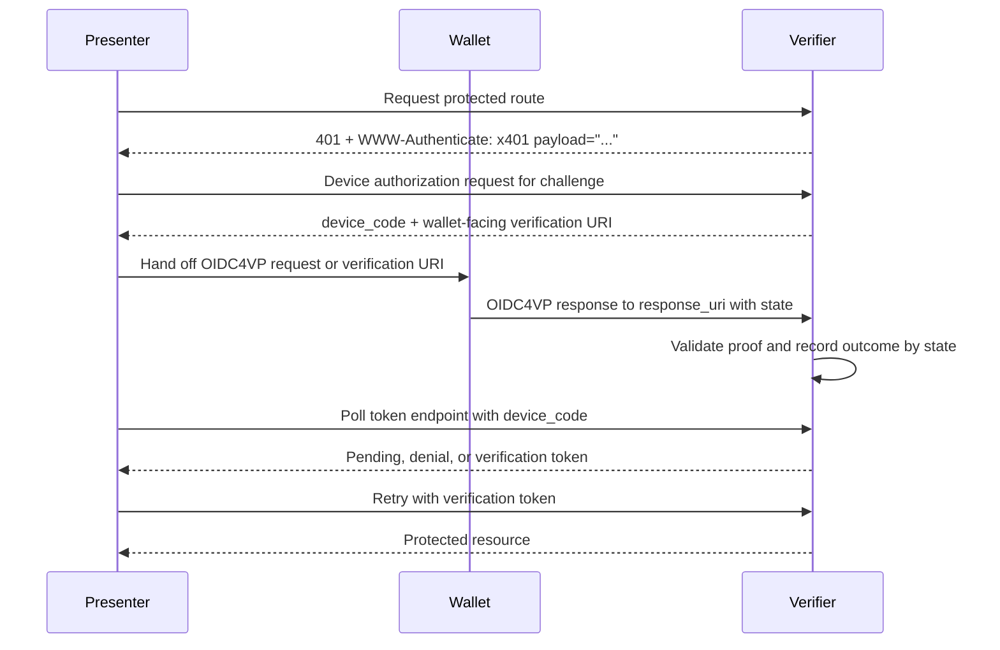
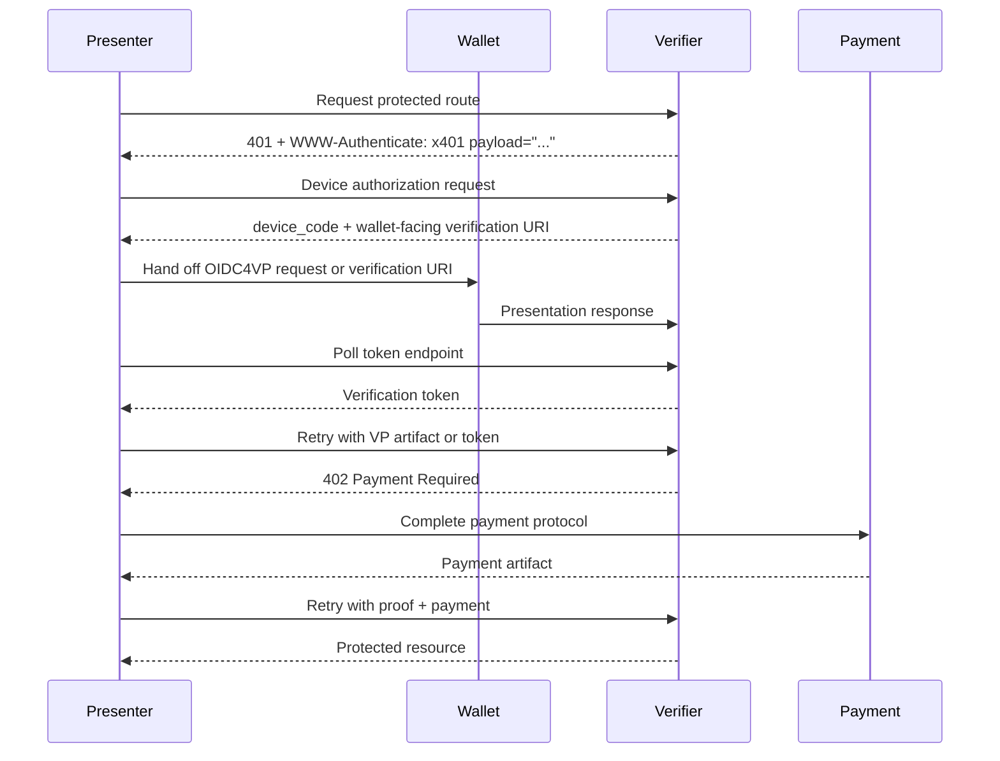

x401: HTTP Proof Challenge Protocol
==================

Status: Draft

Version: 0.1.0

Editors:
~ Daniel Buchner

Participate:
~ [GitHub repo](https://github.com/csuwildcat/x401)
~ [File an issue](https://github.com/csuwildcat/x401/issues)
~ [Commit history](https://github.com/csuwildcat/x401/commits/main)

------------------------------------

## Abstract

x401 defines an HTTP-based, route-scoped proof challenge protocol for requiring credential-based proof before access to a protected resource is granted.

x401 uses:

- **HTTP 401 Unauthorized** to signal that proof is required
- **OpenID for Verifiable Presentations (OIDC4VP)** as the proof request and presentation mechanism
- **OpenID for Verifiable Credential Issuance (OIDC4VCI)** for optional, non-authoritative issuance hints that help presenters discover where qualifying credentials may be obtained
- **OAuth 2.0 Device Authorization** as the standards-aligned polling mechanism for headless presenters to retrieve reusable route-scoped verification tokens after wallet-mediated proof completion

x401 is intentionally separate from payment protocols. When payment is required, it MUST be handled with **HTTP 402 Payment Required** and an appropriate payment protocol. x401 MUST NOT redefine payment semantics.

This document defines the x401 payload, processing rules, interoperability requirements, and examples for proof-only and proof-plus-payment flows.

::: note Protocol Boundary
x401 defines proof challenge semantics only. When payment is required, implementations still use `402 Payment Required` and a separate payment protocol.
:::

## Status of This Document

This is a draft specification. It is provided in a style intended to be similar to DIF single-file specifications.

## Introduction

HTTP provides a standard challenge mechanism for authentication via `401 Unauthorized` and `WWW-Authenticate`, but it does not define a general-purpose, machine-readable protocol for route-scoped proof requirements such as:

- proving personhood
- proving country of residency
- proving membership or accreditation
- proving entitlement issued by a specific issuer class
- proving organizational standing
- proving workload or service identity attributes

At the same time, the OpenID4VP and OIDC4VCI specifications define interoperable mechanisms for requesting presentations and issuing credentials, but they are not themselves an HTTP route challenge protocol.

x401 fills that gap by defining an HTTP-native wrapper that:

- signals proof requirements at the protected route
- carries the x401 payload as a base64url value in the `WWW-Authenticate` response header
- carries or references an OIDC4VP proof request
- optionally includes OIDC4VCI-based issuance hints
- supports agent-to-wallet handoff without requiring the agent to expose an inbound callback endpoint
- composes with, but does not subsume, payment protocols

In the typical flow, a [[ref: Presenter]] receives a challenge from a [[ref: Verifier]], obtains an OAuth 2.0 Device Authorization polling handle bound to the OIDC4VP `state`, hands the embedded or referenced [[ref: Proof Request]] to a [[ref: Wallet]], and polls the verifier's token endpoint until the verifier records proof success or failure. Any [[ref: Issuance Hint]] data is advisory only.

## Design Goals

The goals of x401 are:

1. Define a route-scoped proof challenge for HTTP resources.
2. Reuse existing proof and issuance standards where possible.
3. Support both human-facing and agentic flows.
4. Remain separate from payment semantics.
5. Allow issuance discovery hints without making them authoritative verification rules.
6. Allow proof requirements to be returned by reference.
7. Support wallet-mediated proof completion where the wallet talks directly to the verifier.
8. Allow headless presenters to retrieve proof outcomes by standards-based outbound OAuth polling.
9. Support stateless verifier deployments by allowing challenge and continuation context to be encoded in verifier-protected artifacts.

## Non-Goals

x401 does not:

- define a new credential format
- replace OIDC4VP
- replace OIDC4VCI
- define a wallet invocation protocol
- define a delegation authorization protocol
- define a payment protocol
- require all verifiers to maintain server-side session state

## Terminology

The key words **MUST**, **MUST NOT**, **REQUIRED**, **SHALL**, **SHALL NOT**, **SHOULD**, **SHOULD NOT**, **RECOMMENDED**, **NOT RECOMMENDED**, **MAY**, and **OPTIONAL** in this document are to be interpreted as described in RFC 2119 and RFC 8174.

[[def: Verifier]]:
~ The party protecting a resource or operation and requiring proof.

[[def: Holder]]:
~ The subject or presenter that possesses credentials and can present proof.

[[def: Wallet]]:
~ Software capable of fulfilling an OIDC4VP presentation request.

[[def: Presenter]]:
~ The party or software component that requests the protected route, submits proof material to the [[ref: Verifier]], receives verifier responses, and later retries the protected route. A Presenter can fulfill the OIDC4VP request directly or hand it to a [[ref: Wallet]].

[[def: Proof Request]]:
~ An OpenID4VP Authorization Request, conveyed by reference, that describes the credentials, claims, predicates, or constraints that must be satisfied.

[[def: Issuance Hint]]:
~ A non-authoritative HTTPS origin or DID describing where the presenter may be able to discover OIDC4VCI issuer metadata for credentials that could satisfy the proof request.

[[def: VP Artifact]]:
~ A retry artifact containing the full OIDC4VP response needed to verify proof fulfillment, including the OIDC4VP `vp_token` and any required accompanying parameters such as `state` and `presentation_submission`, encoded for use in the HTTP `Authorization` request header.

[[def: Verification Token]]:
~ A verifier-issued, short-lived retry token returned after successful proof verification and used by the [[ref: Presenter]] on later protected-route requests so that the OIDC4VP presentation does not need to be repeated.

[[def: Device Polling Handle]]:
~ The OAuth 2.0 Device Authorization `device_code` issued to the [[ref: Presenter]] and bound by the [[ref: Verifier]] to the OIDC4VP `state` value for the same x401 challenge.

[[def: x401 Payload]]:
~ The JSON object defined by this specification, UTF-8 encoded, and carried as a base64url value in the `payload` parameter of the `WWW-Authenticate: x401` response header.

## Protocol Overview

### Proof-Only Flow

In the base x401 flow, the [[ref: Presenter]] is the HTTP caller and the [[ref: Wallet]] is the component that completes the OIDC4VP presentation directly with the [[ref: Verifier]]. The [[ref: Presenter]] does not need to receive the OIDC4VP response from the wallet and does not need to expose an inbound callback endpoint.

1. The [[ref: Presenter]] requests a protected route.
2. The [[ref: Verifier]] determines that proof is required.
3. The [[ref: Verifier]] returns `401 Unauthorized` with:
   - `WWW-Authenticate: x401 payload="<base64url-x401-payload>"`
4. The [[ref: Presenter]] obtains a [[ref: Device Polling Handle]] from the verifier's OAuth 2.0 Device Authorization endpoint. The verifier binds that `device_code` to the OIDC4VP `state` value for the challenge.
5. The [[ref: Presenter]] dereferences or forwards the OIDC4VP [[ref: Proof Request]] and hands it to the [[ref: Wallet]] with the wallet-facing verification URI or request details.
6. The [[ref: Wallet]] completes the standard OIDC4VP interaction with the [[ref: Verifier]] and returns the OIDC4VP `state` value in the OIDC4VP response.
7. The [[ref: Verifier]] validates the OIDC4VP response and records the proof outcome under the same `state` value, which also resolves the bound device authorization transaction.
8. The [[ref: Presenter]] polls the verifier's OAuth token endpoint using the `device_code` according to RFC 8628.
9. If proof was accepted, the token endpoint returns a [[ref: Verification Token]] using a standard OAuth 2.0 token response.
10. The [[ref: Presenter]] retries the protected route with the [[ref: Verification Token]] in the HTTP `Authorization` request header.
11. The [[ref: Verifier]] validates the token and returns the protected resource if successful.



## OIDC Boundary and Reuse

x401 stays intentionally narrow. It defines the HTTP challenge at the protected route and the payload that carries proof and acquisition data. It does not redefine the OIDC objects carried inside that payload.

The protocol boundary is:

1. x401 governs the protected-route exchange up to `401 Unauthorized` and the `WWW-Authenticate: x401` challenge containing the x401 payload.
2. OIDC4VP takes over as soon as the [[ref: Presenter]] dereferences `proof.request_uri`.
   - The `proof.request_uri` member is the OIDC4VP `request_uri` transport, and the dereferenced resource MUST satisfy OpenID4VP Section 5.7, Section 5.10.1, and RFC 9101: <https://openid.net/specs/openid-4-verifiable-presentations-1_0-final.html>, <https://datatracker.ietf.org/doc/html/rfc9101>.
3. Presenter-to-verifier proof submission then follows standard OIDC4VP response handling.
   - `vp_token` response semantics: OpenID4VP Section 8.1.
   - `direct_post` and `response_uri`: OpenID4VP Section 8.2.
   - Verifier validation of `client_id` and `nonce` binding: OpenID4VP Section 8.6 and Section 14.1.2.
4. x401 does not change the OIDC4VP response syntax or `vp_token` structure.
5. x401 resumes when the verifier has accepted the OIDC4VP result and the [[ref: Presenter]] retries the original protected route with either a [[ref: VP Artifact]] or a [[ref: Verification Token]].
6. `acquisition` never changes verification behavior. When it points to issuance, it points only to an HTTPS origin that can be resolved using OIDC4VCI issuer metadata rules, or to a DID that can be dereferenced to discover linked HTTPS origins.

If a deployment uses a wallet, browser, device, or application that is separate from the [[ref: Presenter]], that deployment MUST define an explicit continuation mechanism that returns the accepted proof result or retry artifact to the [[ref: Presenter]]. The standards-aligned continuation mechanism defined by this specification is OAuth 2.0 Device Authorization bound to the OIDC4VP `state` value. Other mechanisms can include an OIDC4VP `redirect_uri`, a response code, a polling handle, an OIDC4VP `response_uri` completion endpoint, or another verifier-defined handoff.

### Challenge Correlation

When a verifier creates a challenge, it MUST bind the challenge instance to the protected resource context needed to evaluate the retry. This context includes the requested method, route or resource identifier, proof request, OIDC4VP `nonce`, OIDC4VP `state` when used, expiration time, and expected retry artifact.

This binding MAY be stored server-side, but x401 does not require that storage. A verifier MAY instead encode the binding into verifier-protected artifacts such as a signed Request Object, signed or encrypted OIDC4VP `state` value, signed x401 payload, or self-contained [[ref: Verification Token]]. The OIDC4VP `client_id` identifies the verifier and MUST NOT be used as the identifier of the original protected-route [[ref: Presenter]].

### Device Authorization Binding

The standards-aligned polling mechanism for wallet-mediated x401 completion is OAuth 2.0 Device Authorization. The OIDC4VP `state` value is the verifier's proof-flow correlation value. The OAuth `device_code` is the presenter's token polling credential.

A verifier that advertises `proof.device_authorization`:

1. MUST create or identify an OIDC4VP `state` value for the x401 challenge.
2. MUST bind the Device Authorization `device_code` and `user_code` to that OIDC4VP `state` value.
3. MUST resolve the bound Device Authorization transaction when a wallet-submitted OIDC4VP response with the expected `state` is accepted, denied, or expired.
4. MUST NOT require the presenter to use the raw OIDC4VP `state` value as an OAuth token endpoint grant credential.

This avoids defining a new x401 OAuth grant type while still allowing `state` to be the correlation value that links the wallet-verifier OIDC4VP exchange to the presenter's polling transaction.

### Stateless Continuation

x401 deployments MAY make the interaction between the protected resource and the OIDC processing endpoint stateless by making each leg context-encapsulating.

In a stateless deployment:

1. The x401 payload carried in `WWW-Authenticate` contains only information the presenter needs to continue, such as the OIDC4VP `request_uri`, retry artifact hints, issuance hints, and payment terms or hints.
2. The dereferenced OIDC4VP Request Object, the OIDC4VP `state` value, or both MUST carry the verifier-protected context needed to validate the response and evaluate the retry. This context can include the protected route, method, policy identifier, nonce, expiration, expected retry artifact, and a digest of the x401 payload.
3. The OIDC4VP response returns the `state` value with the `vp_token` according to OpenID4VP. The verifier can reconstruct the challenge context from that protected `state` value without a server-side challenge record.
4. A [[ref: Verification Token]], when issued, MUST be verifier-protected and carry or reference the route, policy, presenter binding, expiration, and satisfied requirements needed for later protected-route evaluation.
5. The protected resource server and the OIDC processing endpoint MAY be separate components if they share the keys, policies, or verification services needed to validate these artifacts.

The `vp_token` alone is not assumed to carry all x401 continuation context. For direct protected-route retry with proof material, the [[ref: Presenter]] MUST send a [[ref: VP Artifact]] that preserves the OIDC4VP response parameters needed by the verifier, including `state` when present.

The OIDC4VP `state` parameter is not a x401 server-side state requirement. In a stateless x401 deployment, it is a standard OIDC4VP response parameter that can carry or reference verifier-protected continuation context. x401 does not define a separate `state` field.

Stateless processing does not remove every need for storage. Verifiers MAY still keep server-side state for replay detection, token revocation, audit, rate limiting, or one-time challenge enforcement. If a deployment requires strict one-time-use challenges, it generally needs replay state or another shared replay-prevention mechanism.

### Proof-Plus-Payment Flow

1. The [[ref: Presenter]] requests a protected route.
2. The [[ref: Verifier]] determines that proof is required.
3. The [[ref: Verifier]] returns `401 Unauthorized` with a `WWW-Authenticate: x401` challenge whose [[ref: x401 Payload]] may also declare that payment is required separately and include decision-relevant payment terms.
4. The [[ref: Presenter]] obtains a [[ref: Device Polling Handle]] and hands the OIDC4VP request to the [[ref: Wallet]].
5. The [[ref: Wallet]] completes the OIDC4VP presentation with the [[ref: Verifier]].
6. The [[ref: Presenter]] polls the token endpoint and receives a [[ref: Verification Token]] if proof is accepted.
7. The [[ref: Verifier]], or the protected route, determines that proof is satisfied but payment remains unsatisfied.
8. The [[ref: Verifier]] returns `402 Payment Required` with payment protocol details.
9. The [[ref: Presenter]] satisfies payment.
10. The [[ref: Presenter]] retries the route.
11. The [[ref: Verifier]] returns the protected resource if both proof and payment are satisfied.



## HTTP Semantics

Status Code | Meaning in a x401-capable deployment | Presenter expectation
----------- | ------------------------------------ | ------------------
`401 Unauthorized` | Proof is required or not yet satisfied | Inspect `WWW-Authenticate: x401` and decode the x401 payload
`402 Payment Required` | Payment remains unsatisfied | Switch to the payment protocol
`403 Forbidden` | Proof was presented but policy satisfaction failed | Do not treat this as another challenge

### 401 for Proof

A server that requires proof for access to a protected resource MUST return `401 Unauthorized`.

The response MUST include a `WWW-Authenticate` challenge using the `x401` scheme.

Example:

```http
HTTP/1.1 401 Unauthorized
WWW-Authenticate: x401 payload="<base64url-x401-payload>"
Cache-Control: no-store
```

The `payload` parameter MUST contain the base64url-encoded [[ref: x401 Payload]]. A x401 challenge response SHOULD NOT require the presenter to parse a response body in order to understand the challenge.

The challenge response uses `WWW-Authenticate` because `Authorization` is an HTTP request header. The presenter uses `Authorization` only when retrying the protected route with a [[ref: VP Artifact]] or [[ref: Verification Token]].

### 402 for Payment

A server that requires payment MUST use `402 Payment Required` and MUST NOT overload x401 to represent payment as proof.

Payment metadata MAY be declared in a x401 payload for informational purposes when both proof and payment are required, but payment satisfaction itself remains governed by the payment protocol used with `402`.

When payment is known to be required before proof is submitted, the verifier SHOULD include enough payment metadata in the x401 payload for the presenter to decide whether to continue before disclosing identity or credential-derived information. This metadata can include payment options with amount, currency or asset, payment scheme, and quote expiration. Protocol-specific payment request details remain part of the later `402 Payment Required` exchange. If the final `402 Payment Required` response materially differs from the payment metadata declared in the x401 payload, the presenter MAY abandon the transaction or restart the proof flow.

### 403 for Failed Policy Satisfaction

If a presenter submits a proof artifact that is structurally valid but does not satisfy the verifier's policy, the verifier SHOULD return `403 Forbidden`.

Examples include:

- credential from an untrusted issuer
- credential does not satisfy predicates
- expired or revoked credential
- insufficient assurance level

## x401 Challenge Scheme

The `WWW-Authenticate` header identifies the presence of a x401 challenge.

### Header Syntax

A x401 challenge uses the following general form:

```http
WWW-Authenticate: x401 payload="<base64url-x401-payload>"
```

### Header Parameters

Name | Definition
---- | ----------
`payload` | REQUIRED. The base64url-encoded UTF-8 JSON [[ref: x401 Payload]]. The encoded value MUST omit padding. The decoded value MUST be a single JSON object.

Other x401 challenge parameters MAY be defined by future versions of this specification. A verifier MUST NOT place authoritative x401 challenge data only in non-`payload` parameters in this version.

## x401 Payload

A x401 payload is a single JSON object encoded into the `payload` parameter of the `WWW-Authenticate: x401` response header. The payload is base64url-encoded, using the URL and filename safe alphabet defined by RFC 4648 Section 5 without padding, so it can be carried safely as an HTTP authentication parameter.

The payload SHOULD remain compact. Large, frequently changing, or sensitive data SHOULD be carried by reference, especially through `proof.request_uri` and the dereferenced OIDC4VP Request Object.

### Top-Level Members

```json
{
  "scheme": "x401",
  "version": "0.1.0",
  "proof": {},
  "acquisition": {},
  "payment": {}
}
```

### Member Definitions

Name | Definition
---- | ----------
`scheme` | REQUIRED. Value MUST be the string `"x401"`.
`version` | REQUIRED. The x401 payload version.
`proof` | REQUIRED. Contains a reference to an OIDC4VP request.
`acquisition` | OPTIONAL. Contains issuance hints as HTTPS origins or DIDs.
`payment` | OPTIONAL. Describes that payment is additionally required, without replacing `402` semantics.

## Proof Object

The proof object references the OIDC4VP request.

### General Structure

```json
{
  "request_format": "openid4vp",
  "client_id": "x509_san_dns:research.example.com",
  "request_uri": "https://research.example.com/x401/requests/c-123",
  "request_uri_method": "get",
  "request_id": "proof-template-board-certified-doctor-v1",
  "satisfied_requirements": [
    "urn:example:x401:satisfaction:board-certified-doctor:v1"
  ],
  "device_authorization": {
    "device_authorization_endpoint": "https://research.example.com/oauth/device_authorization/proof-001",
    "token_endpoint": "https://research.example.com/oauth/token",
    "scope": "x401"
  },
  "retry_artifacts": ["vp", "verification_token"]
}
```

### Members

Name | Definition
---- | ----------
`request_format` | REQUIRED. Value MUST be `"openid4vp"` for this version of the specification.
`client_id` | REQUIRED. Contains the OIDC4VP `client_id` Authorization Request parameter that accompanies `request_uri`. See OpenID4VP Section 5.7 and Section 5.9: <https://openid.net/specs/openid-4-verifiable-presentations-1_0-final.html>.
`request_uri` | REQUIRED. Contains the OIDC4VP `request_uri` value from which the Wallet obtains the Request Object. If dereferenced over HTTP, the returned object MUST satisfy OpenID4VP Section 5.10.1 and RFC 9101: <https://openid.net/specs/openid-4-verifiable-presentations-1_0-final.html>, <https://datatracker.ietf.org/doc/html/rfc9101>.
`request_uri_method` | OPTIONAL. Contains the OIDC4VP `request_uri_method` parameter when the verifier expects POST-based Request URI retrieval. If omitted, Wallets use the default `request_uri` processing defined by RFC 9101 and OpenID4VP.
`request_id` | OPTIONAL. A stable verifier-defined identifier for the proof request template. This value can be reused across challenge instances and routes when they ask for the same proof requirement.
`satisfied_requirements` | OPTIONAL. An array of stable verifier-defined identifiers for the reusable proof requirements that will be marked satisfied if this proof request is fulfilled. These identifiers help presenters and verifiers determine whether a [[ref: Verification Token]] from an earlier x401 challenge can satisfy a later challenge.
`device_authorization` | OPTIONAL. Describes the OAuth 2.0 Device Authorization endpoints the presenter can use to poll for the proof outcome when the wallet submits the OIDC4VP response directly to the verifier.
`retry_artifacts` | OPTIONAL. Array describing the artifacts the presenter may submit when retrying the original protected route. Values defined by this specification are `vp` and `verification_token`. If omitted, presenters MAY try either `vp` or `verification_token`.

### Device Authorization Members

Name | Definition
---- | ----------
`device_authorization_endpoint` | REQUIRED when `device_authorization` is present. The OAuth 2.0 Device Authorization endpoint where the presenter obtains a standard `device_code`, `user_code`, and wallet-facing verification URI. The endpoint SHOULD be specific to the x401 challenge instance or otherwise allow the verifier to bind a standard Device Authorization request to the x401 challenge without requiring a non-standard request parameter.
`token_endpoint` | REQUIRED when `device_authorization` is present. The OAuth 2.0 token endpoint where the presenter polls with the standard Device Authorization Grant.
`scope` | OPTIONAL. OAuth 2.0 scope value the presenter sends to the Device Authorization endpoint. If omitted, the presenter MAY omit `scope`.

## OIDC4VP Reuse Rules

x401 implementations that use OIDC4VP:

1. MUST use an OIDC4VP Authorization Request that is valid under OpenID4VP.
2. MUST preserve the exact OIDC4VP parameter names in the dereferenced Request Object and MUST NOT define x401 aliases for `response_uri`, `redirect_uri`, `response_mode`, `nonce`, `state`, `dcql_query`, `scope`, or `client_metadata`.
3. MUST include an OIDC4VP `client_id`.
4. MUST include a valid OIDC4VP `response_type` for the chosen flow.
5. MUST include either `dcql_query` or `scope` representing a DCQL query, but not both.
6. MUST use `response_uri` when `response_mode` is `direct_post`, and MUST NOT replace it with a x401-specific field.
7. MUST use `request_uri`; the dereferenced Request Object MUST be returned as `application/oauth-authz-req+jwt` and satisfy RFC 9101 processing.
8. SHOULD include a fresh nonce in each request instance.
9. SHOULD use short expiry windows when a signed Request Object is used.
10. The Request Object's `aud` claim MUST follow OpenID4VP Section 5.8.
11. SHOULD prefer a verifier-issued [[ref: Verification Token]] for subsequent route retry when doing multi-step, browser-centric, or wallet-mediated flows.
12. MAY allow direct protected-route retry with a [[ref: VP Artifact]] for callers that do not want to obtain or manage a verifier-issued token.
13. If `proof.device_authorization` is present, MUST include an OIDC4VP `state` value and MUST bind that `state` value to the OAuth 2.0 Device Authorization transaction created for the same x401 challenge.
14. MUST NOT require the presenter to poll the OAuth token endpoint with the OIDC4VP `state` value as a grant credential. The standards-aligned polling credential is the RFC 8628 `device_code`.

### Proof Object Example

::: example Proof Object Example
```json
{
  "request_format": "openid4vp",
  "client_id": "x509_san_dns:research.example.com",
  "request_uri": "https://research.example.com/x401/requests/c-123",
  "request_uri_method": "get",
  "request_id": "proof-template-board-certified-doctor-v1",
  "satisfied_requirements": [
    "urn:example:x401:satisfaction:board-certified-doctor:v1"
  ],
  "device_authorization": {
    "device_authorization_endpoint": "https://research.example.com/oauth/device_authorization/c-123",
    "token_endpoint": "https://research.example.com/oauth/token",
    "scope": "x401"
  },
  "retry_artifacts": ["vp", "verification_token"]
}
```
:::

## Presenter and Holder Binding

This version of x401 does not define a delegation authorization model. If a [[ref: Presenter]] fulfills an OIDC4VP request directly, the verifier evaluates it like any other wallet or [[ref: Holder]]-controlled presentation: the presentation MUST satisfy the OIDC4VP holder binding, proof, `client_id`, `nonce`, credential format, and verifier policy requirements in the proof request.

Any authorization for an agent, workload, or service to possess or use holder-controlled keys is outside the scope of x401. x401 does not define additional delegation evidence, authorization objects, or verifier processing rules for that relationship.

## Acquisition Object

The acquisition object provides non-authoritative issuance hints to help the presenter discover OIDC4VCI issuers that may issue credentials capable of satisfying the proof requirement.

The acquisition object MUST NOT redefine or weaken verifier policy. It is informational only.

::: warning Non-Authoritative Hints
`acquisition` helps a presenter discover candidate credentials and issuers. It does not define the [[ref: Verifier]]'s trusted issuer set, and it does not relax proof validation rules.
:::

### General Structure

```json
{
  "issuers": [
    "https://medical-board.example",
    "did:web:medical-board.example"
  ]
}
```

### Acquisition Members

Name | Definition
---- | ----------
`issuers` | OPTIONAL. An array of [[ref: Issuance Hint]] values. Each value MUST be either an HTTPS origin string or a DID.

### Issuance Hint Values

An HTTPS origin hint:

1. MUST use the `https` scheme.
2. MUST contain only an origin: scheme, host, and optional port.
3. MUST NOT contain a path, query, or fragment.
4. Is interpreted as an OIDC4VCI Credential Issuer Identifier. Presenters derive the well-known credential issuer metadata location from that origin using the OIDC4VCI metadata rules; the x401 payload does not carry the well-known URL itself.

A DID hint:

1. MUST be a valid DID URI.
2. Is dereferenced by the presenter using the applicable DID method.
3. Is used to discover linked HTTPS origins for the issuer. The exact linked-domain mechanism is ecosystem-specific and outside x401.
4. Produces zero or more HTTPS origins, each of which is then resolved using the OIDC4VCI well-known metadata rules.

### OIDC4VCI Reuse Rules

x401 acquisition hints that reference OIDC4VCI:

1. MUST use only the `acquisition.issuers` values defined above.
2. MUST NOT include Credential Offer URIs, authorization server metadata, credential configuration metadata, format metadata, marketplaces, or verifier trust policy.
3. Presenters resolve HTTPS origin hints using OpenID4VCI issuer metadata discovery. See OpenID4VCI Section 12.2.2: <https://openid.net/specs/openid-4-verifiable-credential-issuance-1_0-final.html>.
4. Presenters dereference DID hints to discover linked HTTPS origins, then resolve those origins using OpenID4VCI issuer metadata discovery.
5. Hints MUST be treated by the presenter as hints only.
6. Hints MUST NOT be used as the sole source of trust for proof validation.
7. Hints MUST NOT be interpreted as the verifier's exclusive trusted issuer set unless separately declared in verifier policy.

### OIDC4VCI Acquisition Example

```json
{
  "issuers": [
    "https://medical-board.example",
    "did:web:medical-board.example"
  ]
}
```

## Payment Object

When both proof and payment are required, a x401 payload MAY declare the existence of an additional payment requirement.

The payment object is informational and orchestration-oriented only. It does not replace `402 Payment Required`. Its purpose is to let a presenter evaluate the cost and supported payment methods before deciding whether to submit identity or credential-derived proof. The selected payment protocol remains authoritative for payment settlement, payment authentication, and payment artifact format.

### Example

```json
{
  "required": true,
  "options": [
    {
      "scheme": "x402",
      "amount": "0.25",
      "currency": "USD",
      "description": "Premium medical study access",
      "expires_at": "2026-05-05T18:00:00Z"
    },
    {
      "scheme": "x402",
      "amount": "0.20",
      "currency": "USDC",
      "network": "base",
      "description": "Premium medical study access",
      "expires_at": "2026-05-05T18:00:00Z"
    }
  ]
}
```

### Members

Name | Definition
---- | ----------
`required` | OPTIONAL. Boolean indicating whether payment is additionally required.
`options` | OPTIONAL. Array of payment options or quotes known at challenge time. Each option describes one way the presenter may satisfy the payment requirement.

### Payment Option Members

Name | Definition
---- | ----------
`scheme` | OPTIONAL. Payment protocol identifier for this option.
`amount` | OPTIONAL. Decimal string amount expected for this option. Amounts MUST be interpreted according to `currency`, `asset`, and the selected payment protocol.
`currency` | OPTIONAL. Currency, token, or asset identifier for the amount. Fiat currencies SHOULD use ISO 4217 codes. Non-fiat identifiers are payment-protocol-defined.
`asset` | OPTIONAL. Payment-protocol-specific asset identifier when `currency` alone is insufficient.
`network` | OPTIONAL. Payment-protocol-specific network or settlement system identifier.
`recipient` | OPTIONAL. Payment-protocol-specific recipient or merchant identifier.
`description` | OPTIONAL. Human-readable description of what the payment covers.
`expires_at` | OPTIONAL. Time after which the quoted option may no longer be valid.

## Presenter Processing Rules

A presenter receiving a `401 Unauthorized` response with a `WWW-Authenticate: x401 ...` challenge:

1. MUST treat the response as a proof requirement.
2. MUST extract the `payload` parameter from the `WWW-Authenticate: x401` challenge and base64url-decode it as a UTF-8 JSON [[ref: x401 Payload]].
3. MUST process the `proof` object to determine how to fulfill the requirement.
4. MAY evaluate `payment` metadata before fulfilling the proof request and MAY decline or defer proof submission when payment terms are unacceptable or insufficiently described.
5. MAY use `acquisition` hints to attempt credential discovery or issuance.
6. MUST NOT treat acquisition hints as trusted issuer policy by themselves.
7. MUST hand off OIDC members to standard OpenID4VP processing without renaming or reinterpretation.
8. MAY invoke a wallet or agent subsystem to fulfill the OIDC4VP request.
9. If an acquisition issuer hint is an HTTPS origin, SHOULD resolve OIDC4VCI issuer metadata from that origin.
10. If `proof.device_authorization` is present and the wallet will submit the OIDC4VP response directly to the verifier, SHOULD obtain a standard `device_code` from `proof.device_authorization.device_authorization_endpoint`.
11. If using Device Authorization, MUST poll `proof.device_authorization.token_endpoint` with the standard Device Authorization Grant and MUST follow the `interval`, `authorization_pending`, `slow_down`, `access_denied`, and `expired_token` behavior defined by RFC 8628.
12. MAY retry the original route with:
   - a [[ref: VP Artifact]], if the presenter wants the protected route to process the presentation directly, or
   - a verifier-issued [[ref: Verification Token]], if the presenter completed the OIDC4VP response endpoint flow
13. If `proof.retry_artifacts` is present, MUST choose an artifact type listed there.
14. MUST send a [[ref: VP Artifact]] or [[ref: Verification Token]] in the `Authorization` request header when retrying the protected route.

## Verifier Processing Rules

A verifier implementing x401:

1. MUST return `401 Unauthorized` when proof is required and unsatisfied.
2. MUST include `WWW-Authenticate: x401 ...`.
3. MUST include a valid base64url-encoded x401 payload in the `payload` parameter of the `WWW-Authenticate: x401` challenge.
4. MUST ensure the embedded or referenced OIDC4VP request is valid.
5. MUST NOT define x401-specific aliases for OIDC4VP request or response members.
6. SHOULD include fresh nonce values in each request instance.
7. SHOULD use short-lived expiries when signed Request Objects are used.
8. MUST validate proofs according to the OIDC4VP and credential format rules it relies upon, including the required `client_id` and `nonce` binding checks.
9. MUST evaluate issuer trust, status, revocation, and policy constraints independently of acquisition hints.
10. If issuing a [[ref: Verification Token]], MUST issue it to the [[ref: Presenter]], not merely to the credential subject, and MUST scope it to the verifier, route, policy, validity window, and satisfied proof requirements for which proof was accepted.
11. MUST accept a [[ref: VP Artifact]] in the `Authorization` request header for protected-route retry unless `proof.retry_artifacts` is present and omits `vp`.
12. If advertising `proof.device_authorization`, MUST implement the OAuth 2.0 Device Authorization Grant at the advertised endpoints.
13. If advertising `proof.device_authorization`, MUST bind the issued `device_code` to the OIDC4VP `state`, `nonce`, proof request, protected route context, expiration, and expected retry artifact for the same x401 challenge.
14. If advertising `proof.device_authorization`, MUST return standard RFC 8628 polling errors until proof is accepted, denied, expired, or otherwise failed.
15. If both proof and payment are required and payment terms are known when generating the x401 challenge, SHOULD include decision-relevant payment metadata in the `payment` object.
16. SHOULD return `403 Forbidden` if proof is presented but policy satisfaction fails.
17. MUST use `402 Payment Required` separately if payment is required and remains unsatisfied.

## Authorization Request Header

After receiving a x401 challenge, the presenter retries the protected route using the HTTP `Authorization` request header.

When retrying with a [[ref: Verification Token]], the presenter uses the token type returned by the verifier. The token type defined by this specification is `Bearer`:

```http
Authorization: Bearer <verification-token>
```

When retrying with OIDC4VP proof material directly, the presenter uses the `x401` authorization scheme:

```http
Authorization: x401 vp="<base64url-oidc4vp-response-json>"
```

The `vp` value is the base64url-encoded UTF-8 JSON serialization of the OIDC4VP response parameters needed by the verifier, using the same no-padding encoding as the x401 payload. It MUST preserve standard OpenID4VP member names, including `vp_token`, `state`, and `presentation_submission` when those values are present.

`vp_token` is an OIDC4VP response member inside the decoded `vp` artifact. It is not a separate x401 retry artifact.

A protected route that advertises `vp` in `proof.retry_artifacts` MUST process the supplied value as a proof submission attempt. If verification succeeds, the verifier MAY return the protected resource directly or MAY return a [[ref: Verification Token]] for subsequent retries.

## Retry Models

x401 supports two broad retry models.

Model | Retry artifact | Best fit
----- | -------------- | --------
VP retry | A [[ref: VP Artifact]] is sent back to the protected route | Direct API-to-API flows and callers that do not want to manage a token
Device-polled verification token retry | A verifier-issued [[ref: Verification Token]] is obtained through OAuth 2.0 Device Authorization polling and sent on retry | Wallet-mediated, browser-centric, and headless-agent flows

### Model A: VP Retry

The presenter fulfills the OIDC4VP request and retries the original route with a [[ref: VP Artifact]] in the `Authorization` request header. This model lets the protected resource process the presentation without requiring the presenter to obtain or manage a verifier-issued token.

A [[ref: VP Artifact]] is the base64url-encoded UTF-8 JSON serialization of the OIDC4VP response parameters needed by the verifier, using the same no-padding encoding as the x401 payload. The object MUST preserve standard OIDC4VP member names. When the OIDC4VP response includes `state` or `presentation_submission`, those members MUST be included with `vp_token` inside the decoded `vp` artifact.

Example:

```http
GET /restricted/resource HTTP/1.1
Host: research.example.com
Authorization: x401 vp="<base64url-oidc4vp-response-json>"
```

`vp_token` is an OIDC4VP response member inside the decoded `vp` artifact. It is not a separate x401 retry artifact.

### Model B: Device-Polled Verification Token Retry

The presenter obtains a standard OAuth 2.0 Device Authorization `device_code` from the verifier and then hands the OIDC4VP request or wallet-facing verification URI to a wallet. The wallet fulfills the OIDC4VP request through the OIDC4VP response endpoint identified by the Request Object. For `response_mode=direct_post`, this is the OIDC4VP `response_uri`.

The verifier binds the `device_code` to the OIDC4VP `state` value for the same challenge. After the wallet submits the OIDC4VP response and the verifier accepts it, the presenter's standard Device Authorization polling request returns a [[ref: Verification Token]]. The presenter uses that token when retrying the original route.

The OAuth `client_id` used at the Device Authorization endpoint identifies the presenter as an OAuth client. It is distinct from the OIDC4VP `client_id`, which identifies the verifier in the presentation request.

Device Authorization request:

```http
POST /oauth/device_authorization/proof-001 HTTP/1.1
Host: research.example.com
Content-Type: application/x-www-form-urlencoded

client_id=agent-client-123
&scope=x401
```

Device Authorization response:

```json
{
  "device_code": "GmRhmhcxhwAzkoEqiMEg_DnyEysNkuNhszIySk9eS",
  "user_code": "WDJB-MJHT",
  "verification_uri": "https://research.example.com/x401/device",
  "verification_uri_complete": "https://research.example.com/x401/device?user_code=WDJB-MJHT",
  "expires_in": 300,
  "interval": 5
}
```

Token polling request:

```http
POST /oauth/token HTTP/1.1
Host: research.example.com
Content-Type: application/x-www-form-urlencoded

grant_type=urn:ietf:params:oauth:grant-type:device_code
&device_code=GmRhmhcxhwAzkoEqiMEg_DnyEysNkuNhszIySk9eS
&client_id=agent-client-123
```

Pending response:

```json
{
  "error": "authorization_pending"
}
```

Successful token response:

```json
{
  "access_token": "eyJhbGciOi...",
  "token_type": "Bearer",
  "expires_in": 300
}
```

Retry example:

```http
GET /restricted/resource HTTP/1.1
Host: research.example.com
Authorization: Bearer eyJhbGciOi...
```

Model B is RECOMMENDED for external wallets, browser-centric handoff, and headless agents that cannot expose callback endpoints.

## Verification Tokens

A [[ref: Verification Token]] records the verifier's decision that a presentation satisfied a x401 challenge. It is a retry artifact only; it is not a credential, payment artifact, or new issuer attestation about the credential subject.

A [[ref: Verification Token]] is only a verifier-issued shortcut for later route access after the verifier has already accepted a presentation. It is not a credential, holder key, or authorization for a presenter to create future presentations. Deployments that do not need this shortcut MAY omit verification tokens and require the presenter to submit a fresh OIDC4VP response for each access attempt.

A verifier MAY issue a [[ref: Verification Token]] after accepting an OIDC4VP response. The token:

1. MUST be issued to the [[ref: Presenter]] that completed the presentation flow.
2. MUST NOT rely on the credential subject as the token holder identity unless the credential subject is also the [[ref: Presenter]].
3. MUST be scoped to the verifier audience and to the route, policy, action, or resource class for which proof was accepted.
4. MUST expire, and SHOULD be short-lived.
5. SHOULD include a unique token identifier or otherwise support replay detection and revocation.

The response that carries a [[ref: Verification Token]] is an OAuth 2.0 successful token response. The `access_token` value is the [[ref: Verification Token]], and the `token_type` value tells the presenter how to use that token on the protected-route retry. A deployment MAY issue and validate this token through existing OAuth infrastructure. In the wallet-mediated polling model, the token endpoint uses the OAuth 2.0 Device Authorization Grant defined by RFC 8628.

The wallet sends the OIDC4VP response to the OIDC4VP response endpoint named by the Request Object. For `direct_post`, the wallet sends the OIDC4VP response to the `response_uri` using the standard OpenID4VP response encoding:

```http
POST /x401/complete/proof-001 HTTP/1.1
Host: research.example.com
Content-Type: application/x-www-form-urlencoded

state=<state>&vp_token=<vp-token>&presentation_submission=<presentation-submission>
```

That wallet-to-verifier response is not assumed to return the [[ref: Verification Token]] to the presenter. Instead, the verifier records the outcome under the OIDC4VP `state` value and resolves the OAuth Device Authorization transaction bound to that state.

When the verifier accepts the OIDC4VP response and the presenter polls the token endpoint with the associated `device_code`, the token endpoint returns a standard OAuth token response:

```json
{
  "access_token": "eyJhbGciOi...",
  "token_type": "Bearer",
  "expires_in": 300
}
```

The response carrying this body MUST follow OAuth 2.0 token response requirements, including the cache-control requirements of RFC 6749 and the polling behavior of RFC 8628.

Name | Definition
---- | ----------
`access_token` | REQUIRED. The opaque or structured [[ref: Verification Token]] value issued to the [[ref: Presenter]].
`token_type` | REQUIRED. The HTTP authorization scheme the presenter uses with the token. The value defined by this specification is `Bearer`.
`expires_in` | RECOMMENDED. Lifetime of the token in seconds from the time the response is generated.
`scope` | OPTIONAL. OAuth 2.0 scope value associated with the issued token.

When a [[ref: Verification Token]] is represented as a JWT, its exact claim set is deployment-specific. The token SHOULD identify the [[ref: Presenter]]. The credential subject MAY be recorded as evidence context, but it MUST NOT be the token holder identity unless it is also the [[ref: Presenter]]. The token SHOULD include the accepted `proof.request_id` and `proof.satisfied_requirements` values when those values were present in the x401 proof request.

Presenters MUST send a [[ref: Verification Token]] in the HTTP `Authorization` request header when retrying the protected route. Bearer tokens use the RFC 6750 `Bearer` scheme:

```http
Authorization: Bearer <verification-token>
```

### Reuse Across Routes

OpenID4VP `state`, `nonce`, and DCQL Credential Query `id` values are useful for request-response correlation and holder binding inside a single presentation transaction. They are not, by themselves, stable semantic identifiers for cross-route token reuse.

x401 uses `proof.request_id` and `proof.satisfied_requirements` for reusable proof semantics. A verifier MAY accept a [[ref: Verification Token]] issued for one route on another route only when:

1. the token is valid for the verifier audience and current protected resource;
2. the token has not expired or been revoked;
3. the token is issued to the current [[ref: Presenter]];
4. the token's accepted proof requirements cover the later route's `proof.satisfied_requirements`;
5. any freshness, status, assurance, and policy constraints still hold.

Presenters MAY use metadata returned by a token introspection endpoint, token claims, or verifier-specific token metadata to decide whether to try the token on a later route. The verifier remains authoritative and SHOULD return a new x401 challenge when the token is valid but does not satisfy the later route.

## Examples

## Example 1: Proof-Only

### Initial Request

```http
GET /papers/medical-study-123 HTTP/1.1
Host: research.example.com
```

### Response

```http
HTTP/1.1 401 Unauthorized
WWW-Authenticate: x401 payload="<base64url-x401-payload>"
Cache-Control: no-store
```

Decoded x401 payload, shown for readability:

```json
{
  "scheme": "x401",
  "version": "0.1.0",
  "proof": {
    "request_format": "openid4vp",
    "client_id": "x509_san_dns:research.example.com",
    "request_uri": "https://research.example.com/x401/requests/proof-001",
    "request_uri_method": "get",
    "request_id": "proof-template-board-certified-doctor-v1",
    "satisfied_requirements": [
      "urn:example:x401:satisfaction:board-certified-doctor:v1"
    ],
    "device_authorization": {
      "device_authorization_endpoint": "https://research.example.com/oauth/device_authorization/proof-001",
      "token_endpoint": "https://research.example.com/oauth/token",
      "scope": "x401"
    },
    "retry_artifacts": ["vp", "verification_token"]
  },
  "acquisition": {
    "issuers": [
      "https://medical-board.example",
      "did:web:medical-board.example"
    ]
  }
}
```

### Device Authorization Request

The presenter obtains a standard OAuth 2.0 Device Authorization polling handle for this x401 challenge:

```http
POST /oauth/device_authorization/proof-001 HTTP/1.1
Host: research.example.com
Content-Type: application/x-www-form-urlencoded

client_id=agent-client-123
&scope=x401
```

```json
{
  "device_code": "GmRhmhcxhwAzkoEqiMEg_DnyEysNkuNhszIySk9eS",
  "user_code": "WDJB-MJHT",
  "verification_uri": "https://research.example.com/x401/device",
  "verification_uri_complete": "https://research.example.com/x401/device?user_code=WDJB-MJHT",
  "expires_in": 300,
  "interval": 5
}
```

The verifier binds the `device_code` to the OIDC4VP `state` value in the Request Object for `proof-001`.

### Wallet Completion Request

The OIDC4VP Request Object dereferenced from `proof.request_uri` contains a `response_uri`. After fulfilling the proof request, the wallet posts the OIDC4VP response there:

```http
POST /x401/complete/proof-001 HTTP/1.1
Host: research.example.com
Content-Type: application/x-www-form-urlencoded

state=<state>&vp_token=<vp-token>&presentation_submission=<presentation-submission>
```

The verifier validates the OIDC4VP response and records the outcome under `state`.

### Token Polling

While the wallet completion is pending, the token endpoint returns the standard Device Authorization pending response:

```http
POST /oauth/token HTTP/1.1
Host: research.example.com
Content-Type: application/x-www-form-urlencoded

grant_type=urn:ietf:params:oauth:grant-type:device_code
&device_code=GmRhmhcxhwAzkoEqiMEg_DnyEysNkuNhszIySk9eS
&client_id=agent-client-123
```

```json
{
  "error": "authorization_pending"
}
```

After verification succeeds, the same polling request returns:

```json
{
  "access_token": "eyJhbGciOi...",
  "token_type": "Bearer",
  "expires_in": 300
}
```

### Successful Retry

```http
GET /papers/medical-study-123 HTTP/1.1
Host: research.example.com
Authorization: Bearer eyJhbGciOi...
```

### Alternative Retry Without Token

If the caller does not want to obtain or manage a verification token, it can retry with a VP artifact:

```http
GET /papers/medical-study-123 HTTP/1.1
Host: research.example.com
Authorization: x401 vp="<base64url-oidc4vp-response-json>"
```

## Example 2: Proof Plus Payment

### Initial Request

```http
GET /papers/premium-medical-study-42 HTTP/1.1
Host: research.example.com
```

### Initial Response: Proof Required

```http
HTTP/1.1 401 Unauthorized
WWW-Authenticate: x401 payload="<base64url-x401-payload>"
Cache-Control: no-store
```

Decoded x401 payload, shown for readability:

```json
{
  "scheme": "x401",
  "version": "0.1.0",
  "proof": {
    "request_format": "openid4vp",
    "client_id": "x509_san_dns:research.example.com",
    "request_uri": "https://research.example.com/x401/requests/proofpay-001",
    "request_uri_method": "get",
    "request_id": "proof-template-board-certified-doctor-v1",
    "satisfied_requirements": [
      "urn:example:x401:satisfaction:board-certified-doctor:v1"
    ],
    "device_authorization": {
      "device_authorization_endpoint": "https://research.example.com/oauth/device_authorization/proofpay-001",
      "token_endpoint": "https://research.example.com/oauth/token",
      "scope": "x401"
    },
    "retry_artifacts": ["vp", "verification_token"]
  },
  "acquisition": {
    "issuers": [
      "https://medical-board.example",
      "did:web:medical-board.example"
    ]
  },
  "payment": {
    "required": true,
    "options": [
      {
        "scheme": "x402",
        "amount": "0.25",
        "currency": "USD",
        "description": "Premium medical study access",
        "expires_at": "2026-05-05T18:00:00Z"
      },
      {
        "scheme": "x402",
        "amount": "0.20",
        "currency": "USDC",
        "network": "base",
        "description": "Premium medical study access",
        "expires_at": "2026-05-05T18:00:00Z"
      }
    ]
  }
}
```

### Subsequent Response: Payment Required

After the verifier determines proof is satisfied but payment is still missing:

```http
HTTP/1.1 402 Payment Required
Content-Type: application/json
Cache-Control: no-store
```

```json
{
  "payment": {
    "scheme": "x402",
    "amount": "0.25",
    "currency": "USD",
    "description": "Premium medical study access"
  }
}
```

### Final Retry

The payment artifact is carried according to the selected payment protocol.

```http
GET /papers/premium-medical-study-42 HTTP/1.1
Host: research.example.com
Authorization: Bearer eyJhbGciOi...
```

## Example 3: Direct Agent Presenter With Verification Token

In this example, an agent fulfills the OIDC4VP request directly because it can produce the holder-bound proof expected by the verifier. x401 does not define a separate delegation artifact for this case.

### Proof Reference Fragment

```json
{
  "request_format": "openid4vp",
  "client_id": "x509_san_dns:research.example.com",
  "request_uri": "https://research.example.com/x401/requests/proof-agent-001",
  "request_uri_method": "get",
  "request_id": "proof-template-board-certified-doctor-v1",
  "satisfied_requirements": [
    "urn:example:x401:satisfaction:board-certified-doctor:v1"
  ],
  "device_authorization": {
    "device_authorization_endpoint": "https://research.example.com/oauth/device_authorization/proof-agent-001",
    "token_endpoint": "https://research.example.com/oauth/token",
    "scope": "x401"
  },
  "retry_artifacts": ["vp", "verification_token"]
}
```

### Completion Request

The agent submits the OIDC4VP response with the requested credential-derived evidence and holder-bound presentation proof. The body below is schematic; actual `direct_post` requests use the OIDC4VP response encoding.

```http
POST /x401/complete/proof-agent-001 HTTP/1.1
Host: research.example.com
Content-Type: application/x-www-form-urlencoded

state=proof-agent-001&vp_token=<url-encoded-holder-bound-vp-token>
```

### Token Polling Response

After validating the presentation, holder binding, and verifier policy, the verifier resolves the bound Device Authorization transaction. The agent's next token polling request returns a verification token issued to the presenter:

```json
{
  "access_token": "eyJhbGciOi...",
  "token_type": "Bearer",
  "expires_in": 300
}
```

### Retry

```http
GET /papers/medical-study-123 HTTP/1.1
Host: research.example.com
Authorization: Bearer eyJhbGciOi...
```

## Security Considerations

### Replay Prevention

OIDC4VP requests used within x401 SHOULD include fresh nonce values and short expiries. Verifiers SHOULD reject stale or replayed proofs.

Stateless deployments SHOULD use short expiration windows and verifier-protected `state` values. Strict one-time-use challenge enforcement requires replay tracking or an equivalent shared replay-prevention mechanism.

### Audience Binding

Returned presentations MUST be bound to the OIDC4VP `client_id` and `nonce` values used in the Authorization Request, as required by OpenID4VP Section 14.1.2.

The Request Object's `aud` claim MUST follow OpenID4VP Section 5.8.

### Issuer Trust

Acquisition hints MUST NOT be treated as sufficient trust material. Verifiers MUST apply their own trusted issuer policy and validation logic.

### Proof Submission

Verifiers SHOULD prefer [[ref: Verification Token]] retry in multi-step flows to avoid repeatedly transmitting large VP artifacts. Verifiers that accept direct VP retry SHOULD consider header size limits and SHOULD use compact or referenced proof formats where possible.

The x401 payload is visible to the presenter and to intermediaries that can observe decrypted HTTP traffic. Sensitive challenge context SHOULD be omitted, referenced, signed and encrypted, or placed only in verifier-protected OIDC artifacts.

### Verification Token Scope

Verification tokens SHOULD be short-lived, revocable, and scoped to the accepted x401 challenge. A verifier MUST NOT treat the credential subject as the token holder unless the credential subject is also the presenter that receives and uses the token.

### Device Authorization Polling

Verifiers that support `proof.device_authorization` MUST treat OAuth `device_code` values as bearer-like polling secrets and MUST follow RFC 8628 expiration, polling interval, and error handling requirements. A verifier MUST NOT issue a [[ref: Verification Token]] from a Device Authorization transaction until the associated OIDC4VP presentation, `state`, and `nonce` have been accepted.

OIDC4VP `state` values are correlation values, not OAuth polling credentials. They SHOULD be high entropy, short-lived, verifier-protected or stored server-side, and bound to the corresponding `device_code`.

### Payment Separation

Implementations MUST keep proof and payment semantics separate. A proof artifact MUST NOT be treated as payment, and payment satisfaction MUST NOT be treated as proof satisfaction.

Payment metadata in a x401 payload is for pre-proof decisioning only. It MUST NOT be treated as payment authorization, payment settlement, or a completed payment request unless the selected payment protocol explicitly defines that behavior in the later `402 Payment Required` exchange.

## Privacy Considerations

### Data Minimization

Verifiers SHOULD request the minimum attributes or predicates necessary for access control.

### Selective Disclosure

Implementations SHOULD prefer credential formats and proof methods that support selective disclosure or predicate proofs where available.

### Correlation Risk

Repeated use of the same credential or issuer across multiple routes may introduce correlation risk. Implementers SHOULD consider verifier-specific or minimally identifying proof mechanisms where available.

## IANA Considerations

This draft does not yet request any IANA registrations.

## Conformance

A conforming x401 verifier:

- returns `401 Unauthorized` when proof is required and unsatisfied
- includes `WWW-Authenticate: x401 payload="..."`
- returns a valid base64url-encoded x401 payload in the challenge header
- uses OIDC4VP for the proof request
- supports OAuth 2.0 Device Authorization semantics when `proof.device_authorization` is advertised
- binds Device Authorization transactions to the OIDC4VP `state` value when wallet-mediated polling is used
- accepts VP artifacts in the `Authorization` header unless `proof.retry_artifacts` restricts them
- issues verification tokens to the presenter when token retry is used
- optionally includes OIDC4VCI issuance hints
- includes decision-relevant payment metadata before proof submission when payment is required and terms are known
- keeps payment separate under `402 Payment Required`

A conforming x401 presenter:

- recognizes `WWW-Authenticate: x401`
- decodes and processes the x401 payload from the `payload` challenge parameter
- fulfills or escalates the OIDC4VP proof request
- obtains and polls with a standard OAuth 2.0 `device_code` when wallet-mediated polling is used
- sends VP artifacts or verification tokens in the `Authorization` header when retrying protected routes
- treats OIDC4VCI acquisition hints as optional and non-authoritative
- can evaluate payment metadata before deciding whether to submit proof
- supports separate handling of `402 Payment Required`

## References

### Normative

- [RFC 9110: HTTP Semantics](https://datatracker.ietf.org/doc/html/rfc9110)
- [RFC 2119: Key words for use in RFCs to Indicate Requirement Levels](https://datatracker.ietf.org/doc/html/rfc2119)
- [RFC 8174: Ambiguity of Uppercase vs Lowercase in RFC 2119 Key Words](https://datatracker.ietf.org/doc/html/rfc8174)
- [RFC 4648: The Base16, Base32, and Base64 Data Encodings](https://datatracker.ietf.org/doc/html/rfc4648)
- [RFC 6749: The OAuth 2.0 Authorization Framework](https://datatracker.ietf.org/doc/html/rfc6749)
- [RFC 6750: The OAuth 2.0 Authorization Framework: Bearer Token Usage](https://datatracker.ietf.org/doc/html/rfc6750)
- [RFC 7519: JSON Web Token](https://datatracker.ietf.org/doc/html/rfc7519)
- [RFC 8414: OAuth 2.0 Authorization Server Metadata](https://datatracker.ietf.org/doc/html/rfc8414)
- [RFC 8628: OAuth 2.0 Device Authorization Grant](https://datatracker.ietf.org/doc/html/rfc8628)
- [RFC 9101: OAuth 2.0 JWT-Secured Authorization Request (JAR)](https://datatracker.ietf.org/doc/html/rfc9101)
- [OpenID for Verifiable Presentations 1.0](https://openid.net/specs/openid-4-verifiable-presentations-1_0-final.html)
- [OpenID for Verifiable Credential Issuance 1.0](https://openid.net/specs/openid-4-verifiable-credential-issuance-1_0-final.html)

### Informative

- [W3C Verifiable Credentials Data Model](https://www.w3.org/TR/vc-data-model/)
- [W3C Digital Credentials API](https://www.w3.org/TR/digital-credentials/)

## Appendix A: Minimal Payload

::: example Minimal x401 Payload
```json
{
  "scheme": "x401",
  "version": "0.1.0",
  "proof": {
    "request_format": "openid4vp",
    "client_id": "x509_san_dns:research.example.com",
    "request_uri": "https://research.example.com/x401/requests/c-123"
  }
}
```

The JSON object above is carried in the challenge header as:

```http
WWW-Authenticate: x401 payload="<base64url-minimal-x401-payload>"
```
:::

## Appendix B: Design Summary

x401 is best understood as:

- an HTTP route challenge protocol
- wrapping OIDC4VP for proof fulfillment
- optionally pointing to OIDC4VCI issuance sources
- remaining orthogonal to payment protocols
- composing with `402 Payment Required` rather than absorbing it
