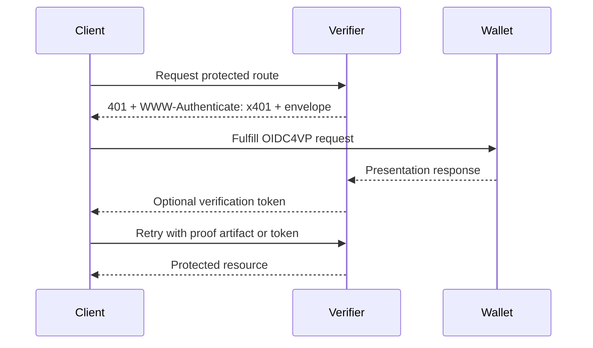
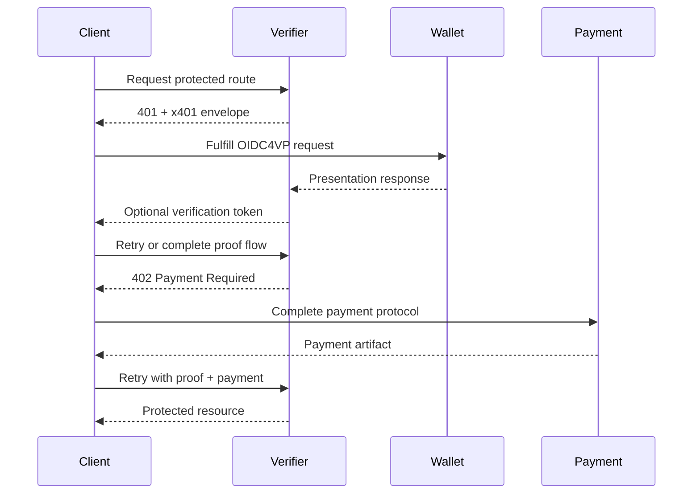

x401: HTTP Proof Challenge Protocol
==================

Status: Draft

Version: 0.1.0

Editors:
~ Daniel Buchner

Participate:
~ [GitHub repo](https://github.com/csuwildcat/x401)
~ [File an issue](https://github.com/csuwildcat/x401/issues)
~ [Commit history](https://github.com/csuwildcat/x401/commits/main)

------------------------------------

## Abstract

x401 defines an HTTP-based, route-scoped proof challenge protocol for requiring credential-based proof before access to a protected resource is granted.

x401 uses:

- **HTTP 401 Unauthorized** to signal that proof is required
- **OpenID for Verifiable Presentations (OIDC4VP)** as the proof request and presentation mechanism
- **OpenID for Verifiable Credential Issuance (OIDC4VCI)** for optional, non-authoritative issuance hints that help callers discover where qualifying credentials may be obtained

x401 is intentionally separate from payment protocols. When payment is required, it MUST be handled with **HTTP 402 Payment Required** and an appropriate payment protocol. x401 MUST NOT redefine payment semantics.

This document defines the x401 envelope, processing rules, interoperability requirements, and examples for proof-only and proof-plus-payment flows.

::: note Protocol Boundary
x401 defines proof challenge semantics only. When payment is required, implementations still use `402 Payment Required` and a separate payment protocol.
:::

## Status of This Document

This is a draft specification. It is provided in a style intended to be similar to DIF single-file specifications.

## Introduction

HTTP provides a standard challenge mechanism for authentication via `401 Unauthorized` and `WWW-Authenticate`, but it does not define a general-purpose, machine-readable protocol for route-scoped proof requirements such as:

- proving personhood
- proving country of residency
- proving membership or accreditation
- proving entitlement issued by a specific issuer class
- proving organizational standing
- proving a delegated or workload identity attribute

At the same time, the OpenID4VP and OIDC4VCI specifications define interoperable mechanisms for requesting presentations and issuing credentials, but they are not themselves an HTTP route challenge protocol.

x401 fills that gap by defining an HTTP-native wrapper that:

- signals proof requirements at the protected route
- carries or references an OIDC4VP proof request
- optionally includes OIDC4VCI-based issuance hints
- supports interactive and agentic clients
- composes with, but does not subsume, payment protocols

In the typical flow, a [[ref: Holder]] receives a challenge from a [[ref: Verifier]] and uses a [[ref: Wallet]] to satisfy the embedded or referenced [[ref: Proof Request]]. Any [[ref: Issuance Hint]] data is advisory only.

## Design Goals

The goals of x401 are:

1. Define a route-scoped proof challenge for HTTP resources.
2. Reuse existing proof and issuance standards where possible.
3. Support both human-facing and agentic flows.
4. Remain separate from payment semantics.
5. Allow issuance discovery hints without making them authoritative verification rules.
6. Allow proof requirements to be returned either by value or by reference.

## Non-Goals

x401 does not:

- define a new credential format
- replace OIDC4VP
- replace OIDC4VCI
- define a wallet invocation protocol
- define a payment protocol
- require all verifiers to maintain server-side session state

## Terminology

The key words **MUST**, **MUST NOT**, **REQUIRED**, **SHALL**, **SHALL NOT**, **SHOULD**, **SHOULD NOT**, **RECOMMENDED**, **NOT RECOMMENDED**, **MAY**, and **OPTIONAL** in this document are to be interpreted as described in RFC 2119 and RFC 8174.

[[def: Verifier]]:
~ The party protecting a resource or operation and requiring proof.

[[def: Holder]]:
~ The subject or caller that possesses credentials and can present proof.

[[def: Wallet]]:
~ Software capable of fulfilling an OIDC4VP presentation request.

[[def: Presenter]]:
~ The party or software component that submits proof material to the [[ref: Verifier]] and later retries the protected route. A Presenter can be the [[ref: Holder]] or a [[ref: Delegated Presenter]].

[[def: Delegated Presenter]]:
~ A [[ref: Presenter]] that is authorized to present credential-derived evidence on behalf of another party, such as an agent, workload, or service acting for a user.

[[def: Delegation Authorization]]:
~ A durable, signed, revocable authorization object created by the holder, user, wallet, or authorization tool that assigns a [[ref: Delegated Presenter]] the ability to present credential-derived evidence on behalf of another party. It is bound to a delegated presenter identifier or key and lists the credential types and constraints the delegated presenter is allowed to use.

[[def: Delegation Evidence]]:
~ The [[ref: Delegation Authorization]] submitted with an OIDC4VP response, plus the presentation proof or other verifier-accepted binding showing that the current presenter controls the delegated presenter identifier or key named in that authorization.

[[def: Proof Request]]:
~ An OpenID4VP Authorization Request, conveyed by value or by reference, that describes the credentials, claims, predicates, or constraints that must be satisfied.

[[def: Issuance Hint]]:
~ A non-authoritative hint describing where the caller may be able to obtain credentials through OIDC4VCI or a compatible issuance mechanism.

[[def: Verification Token]]:
~ A verifier-issued, short-lived retry token returned after successful proof verification and used by the [[ref: Presenter]] on later protected-route requests so that the OIDC4VP presentation does not need to be repeated.

[[def: x401 Envelope]]:
~ The JSON object defined by this specification and returned in the response body of a `401 Unauthorized` response.

## Protocol Overview

### Proof-Only Flow

1. Client requests a protected route.
2. The [[ref: Verifier]] determines that proof is required.
3. The [[ref: Verifier]] returns `401 Unauthorized` with:
   - `WWW-Authenticate: x401 ...`
   - a [[ref: x401 Envelope]] in the response body
4. The client fulfills the proof requirement using the embedded or referenced OIDC4VP [[ref: Proof Request]].
5. If the verifier accepts the presentation, it MAY issue a [[ref: Verification Token]] to the [[ref: Presenter]].
6. The client retries the protected route with the resulting proof artifact or verifier-issued [[ref: Verification Token]].
7. The [[ref: Verifier]] validates the proof or token and returns the protected resource if successful.



## OIDC Boundary and Reuse

x401 stays intentionally narrow. It defines the HTTP challenge at the protected route and the envelope that carries proof and acquisition data. It does not redefine the OIDC objects carried inside that envelope.

The protocol boundary is:

1. x401 governs the protected-route exchange up to `401 Unauthorized`, `WWW-Authenticate: x401`, and the x401 envelope.
2. OIDC4VP takes over as soon as the client processes `proof.request` or dereferences `proof.request_uri`.
   - In `by_value` mode, `proof.request` is a JSON representation of the OIDC4VP Authorization Request parameters and MUST preserve the original OIDC parameter names exactly. See OpenID4VP Section 5 and Section 8: <https://openid.net/specs/openid-4-verifiable-presentations-1_0-final.html>.
   - In `by_reference` mode, `proof.request_uri` is the OIDC4VP `request_uri` transport, and the dereferenced resource MUST satisfy OpenID4VP Section 5.7, Section 5.10.1, and RFC 9101: <https://openid.net/specs/openid-4-verifiable-presentations-1_0-final.html>, <https://datatracker.ietf.org/doc/html/rfc9101>.
3. Wallet-to-verifier proof submission then follows standard OIDC4VP response handling.
   - `vp_token` response semantics: OpenID4VP Section 8.1.
   - `direct_post` and `response_uri`: OpenID4VP Section 8.2.
   - Verifier validation of `client_id` and `nonce` binding: OpenID4VP Section 8.6 and Section 14.1.2.
4. Delegation evidence, when required, is declared by x401 metadata around the OIDC4VP request and submitted with the OIDC4VP response in the same completion transaction. x401 does not change the OIDC4VP `vp_token` structure.
5. x401 resumes only after the verifier has accepted the OIDC4VP result and the caller retries the original protected route with the expected retry artifact.
6. `acquisition` never changes verification behavior. When it points to issuance, it points to standard OIDC4VCI objects such as a Credential Issuer Identifier, Credential Issuer Metadata, or a Credential Offer. See OpenID4VCI Section 4.1.3 and Section 12.2: <https://openid.net/specs/openid-4-verifiable-credential-issuance-1_0-final.html>.

### Proof-Plus-Payment Flow

1. Client requests a protected route.
2. The [[ref: Verifier]] determines that proof is required.
3. The [[ref: Verifier]] returns `401 Unauthorized` with a [[ref: x401 Envelope]] that may also declare that payment is required separately.
4. The client fulfills the proof requirement.
5. The [[ref: Verifier]], or the protected route, determines that proof is satisfied but payment remains unsatisfied.
6. The [[ref: Verifier]] returns `402 Payment Required` with payment protocol details.
7. The client satisfies payment.
8. The client retries the route.
9. The [[ref: Verifier]] returns the protected resource if both proof and payment are satisfied.



## HTTP Semantics

Status Code | Meaning in a x401-capable deployment | Client expectation
----------- | ------------------------------------ | ------------------
`401 Unauthorized` | Proof is required or not yet satisfied | Inspect `WWW-Authenticate: x401` and parse the envelope
`402 Payment Required` | Payment remains unsatisfied | Switch to the payment protocol
`403 Forbidden` | Proof was presented but policy satisfaction failed | Do not treat this as another challenge

### 401 for Proof

A server that requires proof for access to a protected resource MUST return `401 Unauthorized`.

The response MUST include a `WWW-Authenticate` challenge using the `x401` scheme.

Example:

```http
HTTP/1.1 401 Unauthorized
WWW-Authenticate: x401 challenge_id="c-123", retry_artifact="verification_token"
Content-Type: application/json
Cache-Control: no-store
```

The response body MUST contain a x401 envelope.

### 402 for Payment

A server that requires payment MUST use `402 Payment Required` and MUST NOT overload x401 to represent payment as proof.

Payment metadata MAY be declared in a x401 envelope for informational purposes when both proof and payment are required, but payment satisfaction itself remains governed by the payment protocol used with `402`.

### 403 for Failed Policy Satisfaction

If a client presents a proof artifact that is structurally valid but does not satisfy the verifier's policy, the verifier SHOULD return `403 Forbidden`.

Examples include:

- credential from an untrusted issuer
- credential does not satisfy predicates
- expired or revoked credential
- insufficient assurance level

## x401 Challenge Scheme

The `WWW-Authenticate` header identifies the presence of a x401 challenge.

### Header Syntax

A x401 challenge uses the following general form:

```http
WWW-Authenticate: x401 challenge_id="c-123", request_ref="https://api.example.com/x401/requests/c-123", retry_artifact="verification_token"
```

### Header Parameters

Name | Definition
---- | ----------
`challenge_id` | A verifier-generated identifier for the challenge instance. It MUST be unique within the verifier's operational scope for the lifetime of the challenge, MAY be omitted if the verifier uses only by-value requests and does not require challenge correlation, and SHOULD be included when the verifier uses by-reference requests, OIDC4VP response endpoints, or proof-plus-payment orchestration.
`request_ref` | An OPTIONAL URL reference for retrieving a proof request or related metadata. When the `proof` object uses `mode: "by_reference"`, `request_ref` SHOULD match `proof.request_uri`.
`scope_ref` | An OPTIONAL reference to a route or policy scope description.
`retry_artifact` | An OPTIONAL hint describing the type of artifact the verifier expects on retry, for example `raw_presentation` or `verification_token`.

## x401 Envelope

A x401 response body MUST contain a single JSON object with the following top-level members.

### Top-Level Members

```json
{
  "scheme": "x401",
  "version": "0.1.0",
  "challenge_id": "c-123",
  "scope": {},
  "proof": {},
  "acquisition": {},
  "payment": {}
}
```

### Member Definitions

Name | Definition
---- | ----------
`scheme` | REQUIRED. Value MUST be the string `"x401"`.
`version` | REQUIRED. The x401 envelope version.
`challenge_id` | OPTIONAL, but RECOMMENDED. If present, MUST match the `challenge_id` in the `WWW-Authenticate` header when that parameter is present.
`scope` | REQUIRED. Describes the route or policy context for which proof is required.
`proof` | REQUIRED. Contains an OIDC4VP request by value or by reference.
`acquisition` | OPTIONAL. Contains issuance hints, including OIDC4VCI discovery pointers.
`payment` | OPTIONAL. Describes that payment is additionally required, without replacing `402` semantics.

## Scope Object

The scope object describes what protected route or policy the proof requirement applies to.

### Example

```json
{
  "policy_id": "premium-dataset-access-v3",
  "route": "/datasets/:datasetId",
  "method": "GET",
  "resource_class": "premium_dataset",
  "aud": "did:web:api.example.com"
}
```

### Scope Members

Name | Definition
---- | ----------
`policy_id` | OPTIONAL, but RECOMMENDED. A stable identifier for the verifier policy.
`route` | REQUIRED. The route or canonical route template.
`method` | REQUIRED. The HTTP method to which the challenge applies.
`resource_class` | OPTIONAL. A verifier-defined class describing the type of protected resource.
`aud` | REQUIRED. The intended verifier or resource audience identifier for the protected route. This member is x401-specific context. It is not the OIDC4VP Request Object `aud` claim. If an OIDC4VP Request Object is used, its `aud` claim MUST follow OpenID4VP Section 5.8 rather than copying `scope.aud` verbatim: <https://openid.net/specs/openid-4-verifiable-presentations-1_0-final.html>.

## Proof Object

The proof object carries or references the OIDC4VP request.

### General Structure

```json
{
  "request_format": "openid4vp",
  "mode": "by_value",
  "request": {},
  "request_id": "proof-template-active-member-v1",
  "satisfied_requirements": [
    "urn:example:x401:satisfaction:active-member:v1"
  ],
  "delegation": {
    "mode": "accepted",
    "mechanism": "signed_authorization",
    "submission": "vp_token",
    "formats": ["jwt", "data_integrity"]
  },
  "retry_artifact": "verification_token"
}
```

or

```json
{
  "request_format": "openid4vp",
  "mode": "by_reference",
  "client_id": "x509_san_dns:api.example.com",
  "request_uri": "https://api.example.com/x401/requests/c-123",
  "request_uri_method": "get",
  "request_id": "proof-template-active-member-v1",
  "satisfied_requirements": [
    "urn:example:x401:satisfaction:active-member:v1"
  ],
  "delegation": {
    "mode": "accepted",
    "mechanism": "signed_authorization",
    "submission": "vp_token",
    "formats": ["jwt", "data_integrity"]
  },
  "retry_artifact": "verification_token"
}
```

### Members

Name | Definition
---- | ----------
`request_format` | REQUIRED. Value MUST be `"openid4vp"` for this version of the specification.
`mode` | REQUIRED. MUST be either `by_value` or `by_reference`.
`request` | REQUIRED when `mode` is `by_value`. Contains a complete OIDC4VP Authorization Request expressed as JSON members using the exact OIDC parameter names. Examples of members that remain inside `request` are `client_id`, `response_type`, `response_mode`, `response_uri`, `redirect_uri`, `nonce`, `state`, `dcql_query`, `scope`, and `client_metadata`. x401 MUST NOT rename or reinterpret those OIDC4VP members. See OpenID4VP Section 5 and Section 8: <https://openid.net/specs/openid-4-verifiable-presentations-1_0-final.html>.
`client_id` | REQUIRED when `mode` is `by_reference`. Contains the OIDC4VP `client_id` Authorization Request parameter that accompanies `request_uri`. See OpenID4VP Section 5.7 and Section 5.9: <https://openid.net/specs/openid-4-verifiable-presentations-1_0-final.html>.
`request_uri` | REQUIRED when `mode` is `by_reference`. Contains the OIDC4VP `request_uri` value from which the Wallet obtains the Request Object. If dereferenced over HTTP, the returned object MUST satisfy OpenID4VP Section 5.10.1 and RFC 9101: <https://openid.net/specs/openid-4-verifiable-presentations-1_0-final.html>, <https://datatracker.ietf.org/doc/html/rfc9101>.
`request_uri_method` | OPTIONAL. Contains the OIDC4VP `request_uri_method` parameter when the verifier expects POST-based Request URI retrieval. If omitted, Wallets use the default `request_uri` processing defined by RFC 9101 and OpenID4VP.
`request_id` | OPTIONAL. A stable verifier-defined identifier for the proof request template. Unlike `challenge_id`, this value can be reused across challenge instances and routes when they ask for the same proof requirement.
`satisfied_requirements` | OPTIONAL. An array of stable verifier-defined identifiers for the reusable proof requirements that will be marked satisfied if this proof request is fulfilled. These identifiers help clients and verifiers determine whether a [[ref: Verification Token]] from an earlier x401 challenge can satisfy a later challenge.
`delegation` | OPTIONAL. Describes whether delegated presentation is disallowed or accepted and how [[ref: Delegation Evidence]] is submitted with the OIDC4VP response. If omitted, clients MUST treat delegated presentation as disallowed unless they have verifier-specific configuration indicating otherwise.
`retry_artifact` | OPTIONAL. Describes what the caller should present when retrying the original protected route. Example values are `raw_presentation` and `verification_token`.

### Delegation Members

Name | Definition
---- | ----------
`mode` | REQUIRED when `delegation` is present. MUST be either `disallowed` or `accepted`. `disallowed` means the verifier does not accept delegated presenters for this proof request. `accepted` means a delegated presenter MAY submit delegation evidence with the OIDC4VP response.
`mechanism` | REQUIRED when `mode` is `accepted`; otherwise omitted. For this version of x401, the value MUST be `signed_authorization`.
`submission` | REQUIRED when `mode` is `accepted`; otherwise omitted. For this version of x401, the value MUST be `vp_token`.
`formats` | OPTIONAL. Accepted serializations for the [[ref: Delegation Authorization]], for example `jwt`, `data_integrity`, or a credential format identifier supported by the verifier.

## OIDC4VP Reuse Rules

x401 implementations that use OIDC4VP:

1. MUST use an OIDC4VP Authorization Request that is valid under OpenID4VP.
2. MUST preserve the exact OIDC4VP parameter names inside the carried request and MUST NOT define x401 aliases for `response_uri`, `redirect_uri`, `response_mode`, `nonce`, `state`, `dcql_query`, `scope`, or `client_metadata`.
3. MUST include an OIDC4VP `client_id`.
4. MUST include a valid OIDC4VP `response_type` for the chosen flow.
5. MUST include either `dcql_query` or `scope` representing a DCQL query, but not both.
6. MUST use `response_uri` when `response_mode` is `direct_post`, and MUST NOT replace it with a x401-specific field.
7. If `request_uri` is used, the dereferenced Request Object MUST be returned as `application/oauth-authz-req+jwt` and satisfy RFC 9101 processing.
8. SHOULD include a fresh nonce in each request instance.
9. SHOULD use short expiry windows when a signed Request Object is used.
10. If a Request Object is used, its `aud` claim MUST follow OpenID4VP Section 5.8 rather than copying `scope.aud`.
11. SHOULD prefer a verifier-issued [[ref: Verification Token]] for subsequent route retry when doing multi-step, browser-centric, or delegated-presenter flows.

### By-Value Proof Example

::: example By-Value Proof Example
```json
{
  "request_format": "openid4vp",
  "mode": "by_value",
  "request": {
    "client_id": "x509_san_dns:api.example.com",
    "response_type": "vp_token",
    "response_mode": "direct_post",
    "response_uri": "https://api.example.com/x401/complete/c-123",
    "nonce": "n-7f98d5",
    "state": "c-123",
    "dcql_query": {
      "credentials": [
        {
          "id": "over18",
          "format": "dc+sd-jwt",
          "claims": [
            {
              "path": ["age_over_18"],
              "equals": true
            }
          ]
        }
      ]
    }
  },
  "request_id": "proof-template-over18-v1",
  "satisfied_requirements": [
    "urn:example:x401:satisfaction:over18:v1"
  ],
  "retry_artifact": "verification_token"
}
```
:::

### By-Reference Proof Example

::: example By-Reference Proof Example
```json
{
  "request_format": "openid4vp",
  "mode": "by_reference",
  "client_id": "x509_san_dns:api.example.com",
  "request_uri": "https://api.example.com/x401/requests/c-123",
  "request_uri_method": "get",
  "request_id": "proof-template-over18-v1",
  "satisfied_requirements": [
    "urn:example:x401:satisfaction:over18:v1"
  ],
  "retry_artifact": "verification_token"
}
```
:::

## Delegated Presenters

A [[ref: Presenter]] is not always the credential subject. For example, an AI agent, workload, or service can present credential-derived evidence on a user's behalf. x401 calls this party a [[ref: Delegated Presenter]].

Delegation in x401 is standardized on a durable signed [[ref: Delegation Authorization]]. It is the only x401 delegation artifact. The holder, user, wallet, or authorization tool creates one authorization object that identifies the delegated presenter identifier, DID, or key and lists the credential types and constraints the delegated presenter may use. The delegated presenter attaches that same authorization object to matching presentations until it expires or is revoked.

Delegation is processed with the OIDC4VP response by including the [[ref: Delegation Authorization]] in the `vp_token` response. x401 does not change the OIDC4VP response syntax; it uses the normal OIDC4VP ability to return multiple presentation entries. Verifiers that accept delegated presentation SHOULD include a credential query or equivalent request entry for the delegation authorization, for example with an identifier such as `delegation_authorization`.

When a verifier allows delegated presentation:

1. The [[ref: Delegation Authorization]] MUST be signed or otherwise integrity-protected by an authority the verifier accepts for delegation.
2. The verifier MUST validate the [[ref: Delegation Authorization]], expiration, audience, delegate binding, allowed credential types, and any revocation or status result.
3. The verifier MUST verify that the current presenter controls the delegated presenter identifier or verification method named in the authorization.
4. The presentation response MUST remain bound to the OIDC4VP `client_id` and `nonce` values.
5. The verifier MUST reject presentations where the [[ref: Delegated Presenter]] is not authorized for the attempted use or presents a credential type outside the delegated authority.

The holder or user MUST NOT be required to create a new delegated authorization for every x401 presentation request. The same [[ref: Delegation Authorization]] MAY be reused across presentation requests while it remains valid and while the attempted presentation stays within its constraints.

### Delegation Authorization

A [[ref: Delegation Authorization]] represents durable user or holder authorization for a delegated presenter. It can be encoded as a JWT, a Data Integrity secured object, a Verifiable Credential, or another verifier-supported signed object. The wallet, user agent, or authorization tool that creates it is responsible for user-facing consent and revocation controls.

### Delegation Authorization Members

The following fields define the x401 delegation authorization semantics. Concrete serializations MAY rename these fields to match their envelope format, but the semantics MUST be preserved.

```json
{
  "type": "x401_delegated_presentation",
  "issuer": "did:example:wallet",
  "authorization_subject": "did:example:user",
  "delegate": {
    "id": "did:web:agent.example",
    "verification_method": "did:web:agent.example#key-1"
  },
  "audiences": ["https://api.example.com"],
  "credential_types": ["MembershipCredential"],
  "credential_formats": ["dc+sd-jwt"],
  "credential_issuers": ["did:web:issuer.example"],
  "claims": ["membership_active"],
  "satisfied_requirements": [
    "urn:example:x401:satisfaction:active-member:v1"
  ],
  "resource_classes": ["member_report"],
  "nbf": 1735689600,
  "exp": 1767225600,
  "jti": "urn:uuid:8f4f6c2e-7c31-4f54-9ad7-5f9c2d3d0c66",
  "status": "https://wallet.example/delegations/status/8f4f6c2e"
}
```

Name | Definition
---- | ----------
`type` | REQUIRED. MUST be `x401_delegated_presentation`.
`issuer` | REQUIRED. The holder, wallet, user agent, or authorization tool that signs the authorization.
`authorization_subject` | REQUIRED. The holder, user, or subject on whose behalf presentation is authorized.
`delegate` | REQUIRED. Object identifying the delegated presenter and, when available, the verification method or key to which the authorization is bound.
`audiences` | RECOMMENDED. Verifier or protected resource audiences where the delegated presentation authority may be used.
`credential_types` | REQUIRED. Non-empty array of credential type identifiers the delegated presenter is authorized to present.
`credential_formats` | OPTIONAL. Credential formats the delegated presenter is authorized to present.
`credential_issuers` | OPTIONAL. Issuer identifiers the delegated presenter is authorized to use.
`claims` | OPTIONAL. Claim names or paths the delegated presenter is authorized to disclose or prove.
`satisfied_requirements` | OPTIONAL. x401 reusable requirement identifiers the delegated authority may satisfy.
`resource_classes` | OPTIONAL. x401 resource classes where the delegated authority may be used.
`nbf` | OPTIONAL. Time before which the authorization is not valid.
`exp` | REQUIRED. Expiration time.
`jti` | RECOMMENDED. Unique authorization identifier for replay detection, revocation, and audit.
`status` | RECOMMENDED. Status or revocation endpoint for the authorization.
`proof` | REQUIRED when the selected serialization carries an embedded proof. JWT serializations carry the signature in the JWT envelope instead.

If a [[ref: Delegation Authorization]] is present, a verifier MUST reject a delegated presentation containing credential types outside `credential_types` or outside any narrower format, issuer, claim, audience, route, resource, or satisfaction constraint expressed by the authorization.

## Acquisition Object

The acquisition object provides non-authoritative issuance hints to help the caller obtain credentials that could satisfy the proof requirement.

The acquisition object MUST NOT redefine or weaken verifier policy. It is informational only.

::: warning Non-Authoritative Hints
`acquisition` helps a caller discover candidate credentials and issuers. It does not define the [[ref: Verifier]]'s trusted issuer set, and it does not relax proof validation rules.
:::

### General Structure

```json
{
  "credentials": [
    {
      "type": "Over18Credential",
      "issuers": [
        {
          "id": "did:web:issuer.example",
          "credential_issuer": "https://issuer.example",
          "credential_offer_uri": "https://issuer.example/credential-offers/over18",
          "formats": ["dc+sd-jwt"]
        }
      ]
    }
  ]
}
```

### Acquisition Members

Name | Definition
---- | ----------
`credentials` | OPTIONAL. An array of credential acquisition hint objects.

### Credential Acquisition Hint Members

Name | Definition
---- | ----------
`type` | REQUIRED. A human-readable or ecosystem-specific credential type hint.
`issuers` | OPTIONAL. An array of issuer hint objects.
`marketplaces` | OPTIONAL. An array of marketplace or broker endpoints that may assist in obtaining credentials.
`notes` | OPTIONAL. Human-readable notes about issuance.

### Issuer Hint Members

Name | Definition
---- | ----------
`id` | OPTIONAL, but RECOMMENDED. A DID or other issuer identifier.
`credential_issuer` | OPTIONAL. An OIDC4VCI Credential Issuer Identifier. This is not the well-known metadata URL itself. Wallets derive the metadata location from this identifier using OpenID4VCI Section 12.2.2. See OpenID4VCI Section 12.2.1, Section 12.2.2, and Section 12.2.4: <https://openid.net/specs/openid-4-verifiable-credential-issuance-1_0-final.html>.
`credential_offer_uri` | OPTIONAL. A reference to an OIDC4VCI Credential Offer Object. See OpenID4VCI Section 4.1.3: <https://openid.net/specs/openid-4-verifiable-credential-issuance-1_0-final.html>.
`authorization_servers` | OPTIONAL. An array of associated OAuth 2.0 Authorization Server identifiers, using the same meaning as the OIDC4VCI `authorization_servers` metadata member. See OpenID4VCI Section 12.2.4 and RFC 8414: <https://openid.net/specs/openid-4-verifiable-credential-issuance-1_0-final.html>, <https://datatracker.ietf.org/doc/html/rfc8414>.
`formats` | OPTIONAL. An array of credential formats the issuer is believed to support.
`credential_configurations_supported` | OPTIONAL. A subset or hint of `credential_configurations_supported`, using the same structure as OIDC4VCI metadata.

### OIDC4VCI Reuse Rules

x401 acquisition hints that reference OIDC4VCI:

1. If `credential_issuer` is present, it MUST be the Credential Issuer Identifier, not the `/.well-known/openid-credential-issuer` URL.
2. Wallets resolve metadata from `credential_issuer` using OpenID4VCI Section 12.2.2.
3. `authorization_servers` and `credential_configurations_supported`, when present, MUST retain the same semantics they have in OIDC4VCI metadata.
4. `credential_offer_uri`, when present, MUST reference a Credential Offer Object as defined by OpenID4VCI Section 4.1.3.
5. Hints MUST be treated by the client as hints only.
6. Hints MUST NOT be used as the sole source of trust for proof validation.
7. Hints MUST NOT be interpreted as the verifier's exclusive trusted issuer set unless separately declared in verifier policy.

### OIDC4VCI Acquisition Example

```json
{
  "credentials": [
    {
      "type": "AccreditedInvestorCredential",
      "issuers": [
        {
          "id": "did:web:accredited.example",
          "credential_issuer": "https://accredited.example",
          "credential_offer_uri": "https://accredited.example/credential-offers/accredited-investor",
          "authorization_servers": [
            "https://accredited.example/oauth"
          ],
          "formats": [
            "dc+sd-jwt"
          ],
          "credential_configurations_supported": {
            "AccreditedInvestorCredential": {
              "format": "dc+sd-jwt"
            }
          }
        }
      ]
    }
  ]
}
```

## Payment Object

When both proof and payment are required, a x401 envelope MAY declare the existence of an additional payment requirement.

The payment object is informational and orchestration-oriented only. It does not replace `402 Payment Required`.

### Example

```json
{
  "required": true,
  "scheme_hint": "x402",
  "notes": "Payment is required after proof is satisfied."
}
```

### Members

Name | Definition
---- | ----------
`required` | OPTIONAL. Boolean indicating whether payment is additionally required.
`scheme_hint` | OPTIONAL. A hint naming the expected payment protocol.
`notes` | OPTIONAL. Human-readable notes.

## Client Processing Rules

A client receiving a `401 Unauthorized` response with a `WWW-Authenticate: x401 ...` challenge:

1. MUST treat the response as a proof requirement.
2. MUST parse the x401 envelope if the content type is JSON.
3. SHOULD inspect `scope` to determine applicability.
4. MUST process the `proof` object to determine how to fulfill the requirement.
5. MAY use `acquisition` hints to attempt credential discovery or issuance.
6. MUST NOT treat acquisition hints as trusted issuer policy by themselves.
7. MUST hand off OIDC members to standard OpenID4VP processing without renaming or reinterpretation.
8. MAY invoke a wallet or agent subsystem to fulfill the OIDC4VP request.
9. If `credential_offer_uri` is used, MUST follow the OIDC4VCI Credential Offer flow rather than a x401-defined issuance flow.
10. If acting as a [[ref: Delegated Presenter]], MUST submit the requested [[ref: Delegation Evidence]] with the OIDC4VP response in the same verifier transaction.
11. MAY retry the original route with:
   - a raw presentation, if the verifier expects that model, or
   - a verifier-issued [[ref: Verification Token]], if the verifier uses an OIDC4VP response endpoint model
12. MUST send a [[ref: Verification Token]] in the `Authorization` request header when retrying with a token.

## Verifier Processing Rules

A verifier implementing x401:

1. MUST return `401 Unauthorized` when proof is required and unsatisfied.
2. MUST include `WWW-Authenticate: x401 ...`.
3. MUST include a valid x401 envelope in the response body.
4. MUST ensure the embedded or referenced OIDC4VP request is valid.
5. MUST NOT define x401-specific aliases for OIDC4VP request or response members.
6. SHOULD include fresh nonce values in each request instance.
7. SHOULD use short-lived expiries when signed Request Objects are used.
8. MUST validate proofs according to the OIDC4VP and credential format rules it relies upon, including the required `client_id` and `nonce` binding checks.
9. MUST evaluate issuer trust, status, revocation, and policy constraints independently of acquisition hints.
10. MUST validate [[ref: Delegation Evidence]] as part of the same verifier decision when a presenter is acting on behalf of another party.
11. If issuing a [[ref: Verification Token]], MUST issue it to the [[ref: Presenter]], not merely to the credential subject, and MUST scope it to the verifier, route, policy, validity window, and satisfied proof requirements for which proof was accepted.
12. SHOULD return `403 Forbidden` if proof is presented but policy satisfaction fails.
13. MUST use `402 Payment Required` separately if payment is required and remains unsatisfied.

## Retry Models

x401 supports two broad retry models.

Model | Retry artifact | Best fit
----- | -------------- | --------
Raw presentation retry | A presentation or proof artifact is sent back to the protected route | Direct API-to-API flows
Verification token retry | A verifier-issued [[ref: Verification Token]] is sent on retry | Browser-centric, delegated, and multi-step flows

### Model A: Raw Presentation Retry

The client fulfills the OIDC4VP request and retries the original route with the resulting proof material.

Example:

```http
GET /restricted/resource HTTP/1.1
Host: api.example.com
Authorization: x401 proof="eyJhbGciOi..."
```

### Model B: Verification Token Retry

The client fulfills the OIDC4VP request through the OIDC4VP response endpoint, for example the `response_uri` used with `direct_post`, and the verifier issues a [[ref: Verification Token]] that the client uses when retrying the original route.

Retry example:

```http
GET /restricted/resource HTTP/1.1
Host: api.example.com
Authorization: Bearer eyJhbGciOi...
```

Model B is RECOMMENDED for browser-centric, delegated, and multi-step flows.

## Verification Tokens

A [[ref: Verification Token]] records the verifier's decision that a presentation satisfied a x401 challenge. It is a retry artifact only; it is not a credential, payment artifact, or new issuer attestation about the credential subject.

A [[ref: Verification Token]] is not a delegation artifact and does not authorize a delegated presenter to present credentials. Delegated authority comes from the holder-signed [[ref: Delegation Authorization]]. The verification token is only a verifier-issued shortcut for later route access after the verifier has already accepted a presentation. Deployments that do not need this shortcut MAY omit verification tokens and require the presenter to submit a fresh OIDC4VP response, with any required delegation authorization, for each access attempt.

A verifier MAY issue a [[ref: Verification Token]] after accepting an OIDC4VP response. The token:

1. MUST be issued to the [[ref: Presenter]] that completed the presentation flow.
2. MUST NOT rely on the credential subject as the token holder identity unless the credential subject is also the [[ref: Presenter]].
3. MUST be scoped to the verifier audience and to the route, policy, action, or resource class for which proof was accepted.
4. MUST expire, and SHOULD be short-lived.
5. SHOULD include a unique token identifier or otherwise support replay detection and revocation.

When a verifier returns a [[ref: Verification Token]] from a x401 completion endpoint, such as the endpoint identified by an OIDC4VP `response_uri`, the response body SHOULD use this JSON shape:

```json
{
  "token_type": "Bearer",
  "verification_token": "eyJhbGciOi...",
  "expires_in": 300,
  "challenge_id": "proof-001",
  "request_id": "proof-template-active-member-v1",
  "satisfied_requirements": [
    "urn:example:x401:satisfaction:active-member:v1"
  ]
}
```

Name | Definition
---- | ----------
`token_type` | REQUIRED. The HTTP authorization scheme the client uses with the token. The value defined by this specification is `Bearer`.
`verification_token` | REQUIRED. The opaque or structured token value issued to the [[ref: Presenter]].
`expires_in` | RECOMMENDED. Lifetime of the token in seconds from the time the response is generated.
`challenge_id` | RECOMMENDED. The x401 challenge that produced the token.
`request_id` | RECOMMENDED when the x401 proof request included `proof.request_id`.
`satisfied_requirements` | RECOMMENDED when the x401 proof request included `proof.satisfied_requirements`. Contains the reusable proof requirements the verifier accepted.

When a [[ref: Verification Token]] is represented as a JWT, its exact claim set is deployment-specific. The token SHOULD identify the [[ref: Presenter]]. If the token was issued after delegated presentation, it SHOULD include the `jti` or a digest of the [[ref: Delegation Authorization]] that was accepted. The credential subject MAY be recorded as evidence context, but it MUST NOT be the token holder identity unless it is also the [[ref: Presenter]]. The token SHOULD include the accepted `request_id` and `satisfied_requirements` values when those values were present in the x401 proof request.

Clients MUST send a [[ref: Verification Token]] in the HTTP `Authorization` request header when retrying the protected route. Bearer tokens use the RFC 6750 `Bearer` scheme:

```http
Authorization: Bearer <verification-token>
```

### Reuse Across Routes

OpenID4VP `state`, `nonce`, and DCQL Credential Query `id` values are useful for request-response correlation and holder binding inside a single presentation transaction. They are not, by themselves, stable semantic identifiers for cross-route token reuse.

x401 uses `proof.request_id` and `proof.satisfied_requirements` for reusable proof semantics. A verifier MAY accept a [[ref: Verification Token]] issued for one route on another route only when:

1. the token is valid for the verifier audience and current protected resource;
2. the token has not expired or been revoked;
3. the token is issued to the current [[ref: Presenter]];
4. the token's `satisfied_requirements` values cover the later route's `proof.satisfied_requirements`;
5. any freshness, status, assurance, delegation, and policy constraints still hold.

Clients MAY use the `satisfied_requirements` metadata returned with a [[ref: Verification Token]] to decide whether to try the token on a later route. The verifier remains authoritative and SHOULD return a new x401 challenge when the token is valid but does not satisfy the later route.

## Examples

## Example 1: Proof-Only, By Value

### Initial Request

```http
GET /reports/quarterly HTTP/1.1
Host: api.example.com
```

### Response

```http
HTTP/1.1 401 Unauthorized
WWW-Authenticate: x401 challenge_id="proof-001", retry_artifact="verification_token"
Content-Type: application/json
Cache-Control: no-store
```

```json
{
  "scheme": "x401",
  "version": "0.1.0",
  "challenge_id": "proof-001",
  "scope": {
    "policy_id": "active-member-report-access-v1",
    "route": "/reports/quarterly",
    "method": "GET",
    "resource_class": "member_report",
    "aud": "did:web:api.example.com"
  },
  "proof": {
    "request_format": "openid4vp",
    "mode": "by_value",
    "request": {
      "client_id": "x509_san_dns:api.example.com",
      "response_type": "vp_token",
      "response_mode": "direct_post",
      "response_uri": "https://api.example.com/x401/complete/proof-001",
      "nonce": "n-c8f5f6",
      "state": "proof-001",
      "dcql_query": {
        "credentials": [
          {
            "id": "membership",
            "format": "dc+sd-jwt",
            "claims": [
              {
                "path": ["membership_active"],
                "equals": true
              }
            ]
          }
        ]
      }
    },
    "retry_artifact": "verification_token"
  },
  "acquisition": {
    "credentials": [
      {
        "type": "MembershipCredential",
        "issuers": [
          {
            "id": "did:web:issuer.example",
            "credential_issuer": "https://issuer.example",
            "credential_offer_uri": "https://issuer.example/credential-offers/membership",
            "authorization_servers": [
              "https://issuer.example/oauth"
            ],
            "formats": [
              "dc+sd-jwt"
            ]
          }
        ]
      }
    ]
  }
}
```

### Successful Retry

```http
GET /reports/quarterly HTTP/1.1
Host: api.example.com
Authorization: Bearer eyJhbGciOi...
```

## Example 2: Proof-Only, By Reference

### Initial Request

```http
GET /adult-content/video/123 HTTP/1.1
Host: media.example.com
```

### Response

```http
HTTP/1.1 401 Unauthorized
WWW-Authenticate: x401 challenge_id="proof-002", request_ref="https://media.example.com/x401/requests/proof-002", retry_artifact="verification_token"
Content-Type: application/json
Cache-Control: no-store
```

```json
{
  "scheme": "x401",
  "version": "0.1.0",
  "challenge_id": "proof-002",
  "scope": {
    "policy_id": "age-gate-v1",
    "route": "/adult-content/video/:id",
    "method": "GET",
    "resource_class": "age_restricted_media",
    "aud": "did:web:media.example.com"
  },
  "proof": {
    "request_format": "openid4vp",
    "mode": "by_reference",
    "client_id": "x509_san_dns:media.example.com",
    "request_uri": "https://media.example.com/x401/requests/proof-002",
    "request_uri_method": "get",
    "retry_artifact": "verification_token"
  },
  "acquisition": {
    "credentials": [
      {
        "type": "Over18Credential",
        "issuers": [
          {
            "id": "did:web:age-issuer.example",
            "credential_issuer": "https://age-issuer.example",
            "credential_offer_uri": "https://age-issuer.example/credential-offers/over18",
            "formats": [
              "dc+sd-jwt"
            ]
          }
        ]
      }
    ]
  }
}
```

## Example 3: Proof Plus Payment

### Initial Request

```http
GET /datasets/premium/42 HTTP/1.1
Host: api.example.com
```

### Initial Response: Proof Required

```http
HTTP/1.1 401 Unauthorized
WWW-Authenticate: x401 challenge_id="proofpay-001", retry_artifact="verification_token"
Content-Type: application/json
Cache-Control: no-store
```

```json
{
  "scheme": "x401",
  "version": "0.1.0",
  "challenge_id": "proofpay-001",
  "scope": {
    "policy_id": "premium-dataset-accredited-v2",
    "route": "/datasets/premium/:id",
    "method": "GET",
    "resource_class": "premium_dataset",
    "aud": "did:web:api.example.com"
  },
  "proof": {
    "request_format": "openid4vp",
    "mode": "by_reference",
    "client_id": "x509_san_dns:api.example.com",
    "request_uri": "https://api.example.com/x401/requests/proofpay-001",
    "request_uri_method": "get",
    "retry_artifact": "verification_token"
  },
  "acquisition": {
    "credentials": [
      {
        "type": "AccreditedInvestorCredential",
        "issuers": [
          {
            "id": "did:web:accredited.example",
            "credential_issuer": "https://accredited.example",
            "credential_offer_uri": "https://accredited.example/credential-offers/accredited-investor",
            "authorization_servers": [
              "https://accredited.example/oauth"
            ],
            "formats": [
              "dc+sd-jwt"
            ]
          }
        ]
      }
    ]
  },
  "payment": {
    "required": true,
    "scheme_hint": "x402",
    "notes": "Payment is required after proof is satisfied."
  }
}
```

### Subsequent Response: Payment Required

After the verifier determines proof is satisfied but payment is still missing:

```http
HTTP/1.1 402 Payment Required
Content-Type: application/json
Cache-Control: no-store
```

```json
{
  "payment": {
    "scheme": "x402",
    "amount": "0.25",
    "currency": "USD",
    "description": "Premium dataset access"
  }
}
```

### Final Retry

The payment artifact is carried according to the selected payment protocol.

```http
GET /datasets/premium/42 HTTP/1.1
Host: api.example.com
Authorization: Bearer eyJhbGciOi...
```

## Example 4: Delegated Presenter With Verification Token

In this example, `did:web:agent.example` is presenting on behalf of a user. The verifier processes the credential-derived evidence and the delegation authorization in the same OIDC4VP completion transaction.

### Proof Request Fragment

```json
{
  "request_format": "openid4vp",
  "mode": "by_value",
  "request": {
    "client_id": "x509_san_dns:api.example.com",
    "response_type": "vp_token",
    "response_mode": "direct_post",
    "response_uri": "https://api.example.com/x401/complete/proof-agent-001",
    "nonce": "n-agent-58f01",
    "state": "proof-agent-001",
    "dcql_query": {
      "credentials": [
        {
          "id": "membership",
          "format": "dc+sd-jwt",
          "claims": [
            {
              "path": ["membership_active"],
              "equals": true
            }
          ]
        }
      ]
    }
  },
  "request_id": "proof-template-active-member-v1",
  "satisfied_requirements": [
    "urn:example:x401:satisfaction:active-member:v1"
  ],
  "delegation": {
    "mode": "accepted",
    "mechanism": "signed_authorization",
    "submission": "vp_token",
    "formats": ["jwt", "data_integrity"]
  },
  "retry_artifact": "verification_token"
}
```

### Completion Request

The user or wallet authorization tool previously created a durable delegation authorization such as:

```json
{
  "type": "x401_delegated_presentation",
  "issuer": "did:example:wallet",
  "authorization_subject": "did:example:user",
  "delegate": {
    "id": "did:web:agent.example",
    "verification_method": "did:web:agent.example#key-1"
  },
  "audiences": ["https://api.example.com"],
  "credential_types": ["MembershipCredential"],
  "credential_formats": ["dc+sd-jwt"],
  "credential_issuers": ["did:web:issuer.example"],
  "claims": ["membership_active"],
  "satisfied_requirements": [
    "urn:example:x401:satisfaction:active-member:v1"
  ],
  "resource_classes": ["member_report"],
  "nbf": 1735689600,
  "exp": 1767225600,
  "jti": "urn:uuid:8f4f6c2e-7c31-4f54-9ad7-5f9c2d3d0c66",
  "status": "https://wallet.example/delegations/status/8f4f6c2e",
  "proof": "..."
}
```

The delegated presenter submits the OIDC4VP response with the credential-derived evidence, the delegation authorization, and the presentation-time proof that it controls the delegated presenter verification method. The body below is schematic; actual `direct_post` requests use the OIDC4VP response encoding.

```http
POST /x401/complete/proof-agent-001 HTTP/1.1
Host: api.example.com
Content-Type: application/x-www-form-urlencoded

state=proof-agent-001&vp_token=<url-encoded-vp-token-containing-membership-and-delegation_authorization>
```

### Completion Response

After validating the presentation, delegation authorization, and delegated presenter binding, the verifier returns a verification token issued to the delegated presenter:

```http
HTTP/1.1 200 OK
Content-Type: application/json
Cache-Control: no-store
```

```json
{
  "token_type": "Bearer",
  "verification_token": "eyJhbGciOi...",
  "expires_in": 300,
  "challenge_id": "proof-agent-001",
  "request_id": "proof-template-active-member-v1",
  "satisfied_requirements": [
    "urn:example:x401:satisfaction:active-member:v1"
  ]
}
```

### Retry

```http
GET /reports/quarterly HTTP/1.1
Host: api.example.com
Authorization: Bearer eyJhbGciOi...
```

## Security Considerations

### Replay Prevention

OIDC4VP requests used within x401 SHOULD include fresh nonce values and short expiries. Verifiers SHOULD reject stale or replayed proofs.

### Audience Binding

Returned presentations MUST be bound to the OIDC4VP `client_id` and `nonce` values used in the Authorization Request, as required by OpenID4VP Section 14.1.2.

If a Request Object is used, its `aud` claim MUST follow OpenID4VP Section 5.8. `scope.aud` remains descriptive x401 context and does not override the OIDC4VP Request Object rules.

### Issuer Trust

Acquisition hints MUST NOT be treated as sufficient trust material. Verifiers MUST apply their own trusted issuer policy and validation logic.

### Proof Submission

Verifiers SHOULD prefer [[ref: Verification Token]] retry in multi-step flows to avoid repeatedly transmitting large raw presentations.

### Delegated Presentation

Verifiers that allow delegated presentation MUST validate both the credential-derived evidence and the delegation evidence. A presentation from a delegated presenter MUST fail if the delegation is expired, revoked, insufficiently scoped, not bound to the presenter, not bound to the OIDC4VP challenge, or does not authorize every credential type included in the presentation.

The [[ref: Delegation Authorization]] is not a bearer secret. A verifier MUST require presentation-time binding that proves the current presenter controls the delegated presenter identifier or key named in the authorization, and MUST ensure that proof is bound to the OIDC4VP challenge.

### Verification Token Scope

Verification tokens SHOULD be short-lived, revocable, and scoped to the accepted x401 challenge. A verifier that issues a token to a delegated presenter MUST identify the delegated presenter as the token holder and MUST NOT treat the credential subject as the token holder.

### Payment Separation

Implementations MUST keep proof and payment semantics separate. A proof artifact MUST NOT be treated as payment, and payment satisfaction MUST NOT be treated as proof satisfaction.

## Privacy Considerations

### Data Minimization

Verifiers SHOULD request the minimum attributes or predicates necessary for access control.

### Selective Disclosure

Implementations SHOULD prefer credential formats and proof methods that support selective disclosure or predicate proofs where available.

### Correlation Risk

Repeated use of the same credential or issuer across multiple routes may introduce correlation risk. Implementers SHOULD consider verifier-specific or minimally identifying proof mechanisms where available.

## IANA Considerations

This draft does not yet request any IANA registrations.

## Conformance

A conforming x401 verifier:

- returns `401 Unauthorized` when proof is required and unsatisfied
- includes `WWW-Authenticate: x401 ...`
- returns a valid x401 envelope
- uses OIDC4VP for the proof request
- validates delegated presenter evidence when delegated presentation is accepted
- issues verification tokens to the presenter when token retry is used
- optionally includes OIDC4VCI issuance hints
- keeps payment separate under `402 Payment Required`

A conforming x401 client:

- recognizes `WWW-Authenticate: x401`
- processes the x401 envelope
- fulfills or escalates the OIDC4VP proof request
- submits delegation evidence with the OIDC4VP response when acting as a delegated presenter
- sends verification tokens in the `Authorization` header when token retry is used
- treats OIDC4VCI acquisition hints as optional and non-authoritative
- supports separate handling of `402 Payment Required`

## References

### Normative

- [RFC 9110: HTTP Semantics](https://datatracker.ietf.org/doc/html/rfc9110)
- [RFC 2119: Key words for use in RFCs to Indicate Requirement Levels](https://datatracker.ietf.org/doc/html/rfc2119)
- [RFC 8174: Ambiguity of Uppercase vs Lowercase in RFC 2119 Key Words](https://datatracker.ietf.org/doc/html/rfc8174)
- [RFC 6749: The OAuth 2.0 Authorization Framework](https://datatracker.ietf.org/doc/html/rfc6749)
- [RFC 6750: The OAuth 2.0 Authorization Framework: Bearer Token Usage](https://datatracker.ietf.org/doc/html/rfc6750)
- [RFC 7519: JSON Web Token](https://datatracker.ietf.org/doc/html/rfc7519)
- [RFC 8414: OAuth 2.0 Authorization Server Metadata](https://datatracker.ietf.org/doc/html/rfc8414)
- [RFC 9101: OAuth 2.0 JWT-Secured Authorization Request (JAR)](https://datatracker.ietf.org/doc/html/rfc9101)
- [OpenID for Verifiable Presentations 1.0](https://openid.net/specs/openid-4-verifiable-presentations-1_0-final.html)
- [OpenID for Verifiable Credential Issuance 1.0](https://openid.net/specs/openid-4-verifiable-credential-issuance-1_0-final.html)

### Informative

- [W3C Verifiable Credentials Data Model](https://www.w3.org/TR/vc-data-model/)
- [W3C Digital Credentials API](https://www.w3.org/TR/digital-credentials/)

## Appendix A: Minimal Envelope

::: example Minimal x401 Envelope
```json
{
  "scheme": "x401",
  "version": "0.1.0",
  "scope": {
    "route": "/resource/:id",
    "method": "GET",
    "aud": "did:web:api.example.com"
  },
  "proof": {
    "request_format": "openid4vp",
    "mode": "by_reference",
    "client_id": "x509_san_dns:api.example.com",
    "request_uri": "https://api.example.com/x401/requests/c-123"
  }
}
```
:::

## Appendix B: Design Summary

x401 is best understood as:

- an HTTP route challenge protocol
- wrapping OIDC4VP for proof fulfillment
- optionally pointing to OIDC4VCI issuance sources
- remaining orthogonal to payment protocols
- composing with `402 Payment Required` rather than absorbing it
